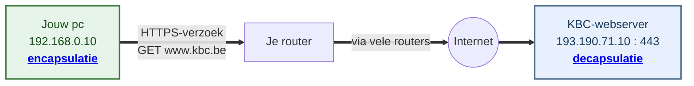
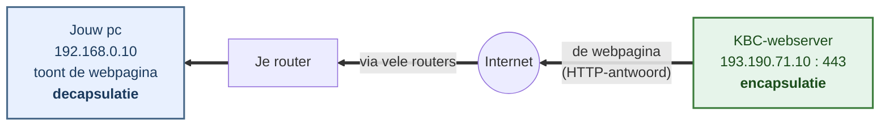
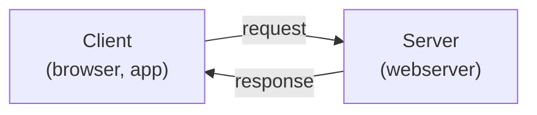
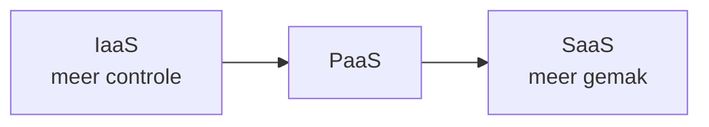
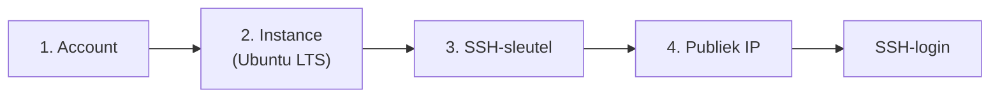
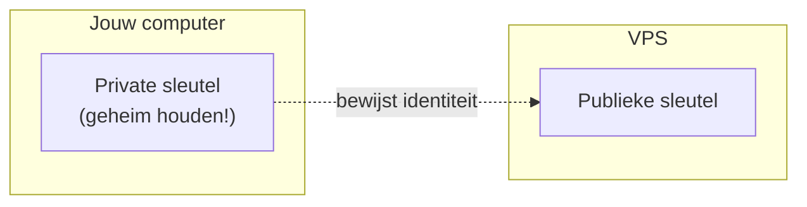
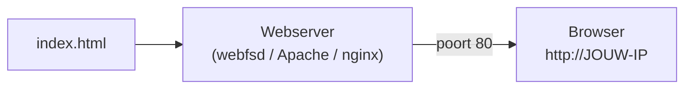

# Netwerk fundamentals

In dit hoofdstuk frissen we de **netwerkbasis** op en zetten we de eerste stap richting deployment. Wat je doet:

- het **TCP/IP-model** herhalen
- leren wat een **server** en de **cloud** zijn
- zelf een **cloud server (VPS)** opzetten
- veilig inloggen via **SSH**
- enkele **Linux-basiscommando's** opfrissen
- als eindopdracht een **statische webpagina deployen** (met `webfsd`, **Apache** of **nginx**)

Dit is het fundament voor de rest van de cursus: DNS ([hoofdstuk 2](./hoofdstuk-2-dns.md)) en HTTP(S) ([hoofdstuk 3](./hoofdstuk-3-http.md)-[4](./hoofdstuk-4-https.md)) bouwen rechtstreeks verder op wat je hier opzet.

## Leerdoelen

Na dit hoofdstuk kan je:

- **het TCP/IP-model** beschrijven en de rol van elke laag uitleggen (*OLR 04*, *OLR 12*)
- **uitleggen** wat een server is en hoe een client met een server communiceert (*OLR 04*)
- **de cloud** situeren en het verschil tussen IaaS, PaaS en SaaS benoemen, en een **VPS** binnen dat geheel plaatsen (*OLR 04*, *OLR 12*)
- **een cloud server (VPS)** aanmaken bij een cloudprovider en de basisconfiguratie uitvoeren (*OLR 04*)
- **via SSH** veilig inloggen op een Linux-server en uitleggen waarom sleutelauthenticatie te verkiezen is boven wachtwoorden (*OLR 04*, *OLR 13*)
- **Linux-basiscommando's** correct toepassen om te navigeren en bestanden te beheren (`pwd`, `ls`, `cd`, `cat`, `mkdir`, `nano`, …) (*OLR 04*)
- **een statische webpagina deployen** op de VPS met `webfsd`, Apache of nginx en de bereikbaarheid verifiëren (*OLR 03*, *OLR 04*, *OLR 07*)
- **de stappen documenteren** zodat de deployment herhaalbaar is (*OLR 06*)

:::info[OLR-koppeling]

Dit hoofdstuk koppelt aan meerdere leerdoelen:

- **OLR 04** - inloggen via SSH, een Linux-server klaarmaken en deployen via een VPS
- **OLR 13** - SSH veilig configureren
- **OLR 06** - een herhaalbare deployment documenteren
- **OLR 12** - soorten cloud-diensten afwegen

:::

## Theorie

### Het TCP/IP-model (herhaling)

Wanneer twee computers over een netwerk praten, gebeurt dat niet in één grote stap maar in **lagen**. Elke laag heeft een eigen verantwoordelijkheid en praat enkel met de laag erboven en eronder. Dit **gelaagde model** maakt netwerken beheersbaar: je kunt één laag aanpassen (bv. van wifi naar kabel) zonder de rest te herschrijven.

In deze cursus gebruiken we het **TCP/IP-model in vijf lagen**. Dit is een veelgebruikte variant die de onderste laag opsplitst in een **datalink-** en een **fysieke** laag - handig omdat MAC-adressering (datalink) en het effectieve signaal op de kabel (fysiek) duidelijk gescheiden worden. Het oudere **OSI-model** (zeven lagen) zie je vooral in theorie. De mapping staat in de laatste kolom.

| # | TCP/IP-laag (5) | Taak | Protocollen | Adressering (bron → bestemming) | Eenheid | OSI |
|---|-----------------|------|-------------|---------------------------------|---------|-----|
| 1 | **Fysiek** | Bits als signaal versturen (spanning, licht, radio) | kabel, glasvezel, radiogolven | - (geen adressering) | bits | 1 |
| 2 | **Datalink** | Fysieke adressering (MAC), frames over de link | Ethernet, wifi (802.11) | bron-**MAC** → bestemmings-**MAC** | frame | 2 |
| 3 | **Netwerk** | Logische adressering en routering tussen netwerken | **IP** (IPv4/IPv6), ICMP | bron-**IP** → bestemmings-**IP** | pakket | 3 |
| 4 | **Transport** | Betrouwbaarheid, poorten, segmentatie | **TCP**, **UDP** | bron**poort** → bestemmings**poort** | segment | 4 |
| 5 | **Applicatie** | Communicatie tussen programma's | HTTP, HTTPS, DNS, SSH, FTP | - | data / bericht | 5-7 |

Hieronder kort wat elke laag doet, van onder (de fysieke verbinding) naar boven (dichtst bij de gebruiker).

#### Fysieke laag (laag 1)

De onderste laag verstuurt de **bits** (enen en nullen) als een echt **signaal** over een fysiek medium. Hoe dat signaal eruitziet, hangt af van het medium:

- **koperkabel** (UTP, Ethernet) - als elektrische spanning
- **glasvezel** - als lichtpulsen
- **wifi** - als radiogolven door de lucht

De laag **begrijpt de bits niet**, maar brengt ze van punt A naar punt B. Ook **bandbreedte** (bits per seconde) speelt op dit niveau.

#### Datalinklaag (laag 2)

Deze laag verzorgt het transport over **één lokale verbinding** (LAN), bijvoorbeeld alle toestellen op hetzelfde wifi-netwerk of dezelfde switch. Ze groepeert de bits in **frames** en gebruikt **MAC-adressen** om binnen dat lokale netwerk de juiste **netwerkkaart** aan te spreken.

- Een **MAC-adres** (bv. `00:1A:2B:3C:4D:5E`) is een uniek, in de netwerkkaart ingebakken hardware-adres. Het wordt **hexadecimaal** geschreven: 6 groepjes van 2 tekens (0-9 en A-F), samen 48 bits.
- Een **switch** werkt op deze laag: hij stuurt frames door naar de juiste poort op basis van het MAC-adres.

Belangrijk: de datalinklaag raakt **niet voorbij het lokale netwerk**. Om een ander netwerk te bereiken, is de netwerklaag nodig.

#### Netwerklaag (laag 3)

Terwijl de datalinklaag binnen één netwerk blijft, zorgt de netwerklaag dat data **over de grenzen van netwerken heen** raakt - dwars door het internet. Ze werkt met **IP-adressen** (logische adressen) en met **routering**.

- Een **IP-adres** (bv. `93.184.216.34` in IPv4, of een langer IPv6-adres) identificeert een **machine** waar ook ter wereld.
- **Routers** geven een **pakket** stap voor stap (hop per hop) door, telkens een stukje dichter bij de bestemming. Elke router kiest de volgende stap op basis van het bestemmings-IP.
- **DNS** vertaalt een leesbare domeinnaam (`example.com`) naar een IP-adres (zie [hoofdstuk 2](./hoofdstuk-2-dns.md)).

De netwerklaag biedt **geen garanties** dat alles aankomt - dat is net de taak van de transportlaag erboven. Samen bepalen **IP-adres + poort** aan beide kanten precies één verbinding.

#### Transportlaag (laag 4)

De netwerklaag bezorgt data bij de juiste **machine**. De transportlaag gaat verder: ze brengt de data bij het juiste **programma** (via poorten) en zorgt - bij TCP - dat alles **volledig en in volgorde** aankomt. Grote data wordt in **segmenten** geknipt en aan de andere kant weer samengevoegd.

**Waarom heb je een poort nodig?** Op één machine draaien meestal **meerdere programma's tegelijk**: bv. een webserver, een SSH-dienst en een database. Een **IP-adres** brengt data wel bij de juiste machine, maar niet bij het juiste programma. Dat doet de **poort**: het "huisnummer" binnen de machine.

> Vergelijking: het **IP-adres** is het adres van het *gebouw*, de **poort** is het *bureau- of busnummer* binnen dat gebouw. Zonder busnummer weet de postbode niet bij wie de brief moet.

Een **poortnummer** (16 bits, 0-65535) zegt dus voor welk programma een segment bedoeld is. Bij een verbinding spelen er altijd twee poorten mee:

- de **bestemmingspoort** = de dienst die je aanspreekt. Die ligt vast per protocol (een *well-known port*, bv. 443 voor HTTPS).
- de **bronpoort** = een willekeurig, tijdelijk nummer dat jouw toestel kiest (een *ephemeral port*, bv. 54123). Zo weet de server naar welke poort hij zijn antwoord moet terugsturen.

| Poort | Dienst |
|-------|--------|
| 22 | SSH |
| 80 | HTTP |
| 443 | HTTPS |
| 53 | DNS |

Een webserver luistert dus standaard op **poort 80** (HTTP) of **443** (HTTPS). Via **poort 22** (SSH) log je in op de server.

##### Twee protocollen: TCP en UDP

Het grote verschil is *betrouwbaarheid versus snelheid*.

| | **TCP** | **UDP** |
|--|---------|---------|
| Verbinding | verbindingsgericht (eerst opzetten) | verbindingsloos (direct versturen) |
| Garanties | volledig, in volgorde, foutcontrole | geen - segmenten kunnen verdwijnen of door elkaar komen |
| Snelheid | iets trager (overhead) | sneller, weinig overhead |
| Typisch voor | HTTP(S), SSH, e-mail | streaming, gaming, DNS-queries, VoIP |

**TCP** (*Transmission Control Protocol*) is **betrouwbaar**:

- elk segment krijgt een **bevestiging** (*ACK*). Komt die niet, dan volgt **hertransmissie**.
- via volgnummers zet de ontvanger alles weer **op volgorde**.
- de verbinding start met een **three-way handshake**: `SYN` → `SYN-ACK` → `ACK`. Pas daarna begint de datastroom.

**UDP** (*User Datagram Protocol*) is **snel**, zonder garanties:

- geen handshake, geen hertransmissie
- prima als snelheid primeert (bij live video stoort een gemiste frame minder dan vertraging)

In deze cursus werk je vooral met **TCP**: zowel webpagina's opvragen (HTTP/HTTPS) als inloggen via SSH gebeurt erover.

#### Applicatielaag (laag 5)

De laag waar **programma's** met elkaar communiceren. Hier leeft het eigenlijke bericht - bijvoorbeeld een **HTTP-verzoek** van je browser. Typische protocollen: **HTTP(S)**, **DNS**, **SSH**, **FTP** en e-mailprotocollen. Deze laag bepaalt het *formaat* van de data, niet hoe ze fysiek op de bestemming raakt.

Over deze applicatieprotocollen lees je later meer: **DNS** in [hoofdstuk 2](./hoofdstuk-2-dns.md), **HTTP** in [hoofdstuk 3](./hoofdstuk-3-http.md) en **HTTPS** in [hoofdstuk 4](./hoofdstuk-4-https.md).

#### Encapsulatie en decapsulatie

Data reist in twee richtingen door de stack:

- **Encapsulatie** (verzenden): elke laag voegt van boven naar beneden zijn eigen **header** toe. Het bericht wordt zo verpakt tot segment → pakket → frame → bits.
- **Decapsulatie** (ontvangen): elke laag pelt van onder naar boven zijn header weer af, tot enkel het oorspronkelijke bericht overblijft.

Elke laag voegt op zijn eigen niveau **twee adressen** toe:

- een **bronadres** = waar het vandaan komt
- een **bestemmingsadres** = waar het naartoe moet

#### Voorbeeld: surfen naar `www.kbc.be`

We volgen één verzoek door alle lagen: **je surft naar `https://www.kbc.be`**. Eerst de **encapsulatie** bij jou, daarna de **decapsulatie** bij KBC. Onderstaande adressen komen in beide schema's terug - houd ze als **leidraad** bij de hand:

| Adres | Bron (jouw toestel) | Bestemming |
|-------|---------------------|------------|
| **Poort** | `51514` (willekeurig gekozen) | `443` (HTTPS) |
| **IP-adres** | `192.168.0.10` (jouw toestel) | `193.190.71.10` (KBC-webserver) |
| **MAC-adres** | `00:12:F1:1E:E8:93` (jouw netwerkkaart) | `A4:5E:60:1F:23:8B` (je router) |

De reis verloopt in twee richtingen: eerst gaat jouw **verzoek** naar KBC, daarna komt het **antwoord** (de webpagina) terug.

**1. Het verzoek - van jouw pc naar de KBC-server**

Jouw pc bouwt het verzoek op (**encapsulatie**, de stack omlaag). De KBC-server pakt het weer uit (**decapsulatie**, de stack omhoog).



Het verzoek wordt onderweg opgeknipt in **pakketten** en komt zo, hop per hop, aan bij de KBC-server.

**2. Het antwoord - van de KBC-server terug naar jou**

Nu draaien de rollen om: de KBC-server bouwt het antwoord op (**encapsulatie**) en jouw pc pakt het uit (**decapsulatie**).



De server stuurt de gevraagde pagina terug. Jouw browser ontvangt de pakketten, zet ze weer samen en toont `www.kbc.be`.

> **Onthoud:** **encapsulatie** gebeurt enkel bij de **verzender** en **decapsulatie** enkel bij de **ontvanger**. De routers ertussen kijken alleen naar de adressen en sturen het pakket door - zij pakken het niet volledig uit.

##### Encapsulatie bij de verzender (jouw toestel)

Je browser maakt een **HTTPS-verzoek** voor `www.kbc.be`. Dat "Bericht" (rechts, groen) blijft ongewijzigd. Elke laag **plakt er links een eigen header-blok bij**, telkens met een **bron- en bestemmingsadres** op zijn niveau. Zo groeit de data-eenheid van **bericht → segment → packet → frame → bits**:

<div class="enc">
  <div class="enc-layer">
    <div class="enc-title">5 · Applicatie - Bericht</div>
    <div class="enc-row">
      <span class="enc-block enc-msg">Bericht = GET {"https://www.kbc.be"}</span>
    </div>
  </div>
  <div class="enc-arrow">↓ <span>voeg poort-header toe</span></div>
  <div class="enc-layer">
    <div class="enc-title">4 · Transport - Segment</div>
    <div class="enc-row">
      <span class="enc-block enc-port">Bronpoort = 51514 · Bestemmingspoort = 443 (HTTPS)</span>
      <span class="enc-block enc-msg">Bericht</span>
    </div>
  </div>
  <div class="enc-arrow">↓ <span>voeg IP-header toe</span></div>
  <div class="enc-layer">
    <div class="enc-title">3 · Netwerk - Packet</div>
    <div class="enc-row">
      <span class="enc-block enc-ip">Bron-IP = 192.168.0.10 · Bestemmings-IP = 193.190.71.10 (KBC)</span>
      <span class="enc-block enc-port">Poorten</span>
      <span class="enc-block enc-msg">Bericht</span>
    </div>
  </div>
  <div class="enc-arrow">↓ <span>voeg MAC-header toe</span></div>
  <div class="enc-layer">
    <div class="enc-title">2 · Datalink - Frame</div>
    <div class="enc-row">
      <span class="enc-block enc-mac">Bron-MAC = 00:12:F1:1E:E8:93 · Bestemmings-MAC = A4:5E:60:1F:23:8B (router)</span>
      <span class="enc-block enc-ip">IP-adressen</span>
      <span class="enc-block enc-port">Poorten</span>
      <span class="enc-block enc-msg">Bericht</span>
    </div>
  </div>
  <div class="enc-arrow">↓ <span>zet om in bits</span></div>
  <div class="enc-layer">
    <div class="enc-title">1 · Fysiek - Bits</div>
    <div class="enc-row">
      <span class="enc-block enc-bits">0101 1010 0110 … (signaal op de link)</span>
    </div>
  </div>
</div>

> **Let op:** het bestemmings-**IP** is de KBC-webserver, maar het bestemmings-**MAC** is **je router** - niet KBC. Een MAC-adres geldt enkel op je lokale netwerk en wordt bij elke router-hop vervangen. Het **IP-adres blijft wél hetzelfde** tot bij KBC.

##### Decapsulatie bij de ontvanger (KBC-webserver)

De **KBC-webserver** doet exact het omgekeerde: elke laag **leest zijn eigen header-blok uit en verwijdert het**, tot enkel het oorspronkelijke "Bericht" overblijft:

<div class="enc">
  <div class="enc-layer">
    <div class="enc-title">1 · Fysiek - Bits ontvangen</div>
    <div class="enc-row">
      <span class="enc-block enc-bits">0101 1010 0110 … (signaal van de link)</span>
    </div>
  </div>
  <div class="enc-arrow">↓ <span>bits → frame</span></div>
  <div class="enc-layer">
    <div class="enc-title">2 · Datalink - Frame ontvangen</div>
    <div class="enc-row">
      <span class="enc-block enc-mac">lees + verwijder bron/bestemmings-MAC</span>
      <span class="enc-block enc-ip">IP-adressen</span>
      <span class="enc-block enc-port">Poorten</span>
      <span class="enc-block enc-msg">Bericht</span>
    </div>
  </div>
  <div class="enc-arrow">↓ <span>MAC-header verwijderd</span></div>
  <div class="enc-layer">
    <div class="enc-title">3 · Netwerk - Packet</div>
    <div class="enc-row">
      <span class="enc-block enc-ip">lees + verwijder bron/bestemmings-IP</span>
      <span class="enc-block enc-port">Poorten</span>
      <span class="enc-block enc-msg">Bericht</span>
    </div>
  </div>
  <div class="enc-arrow">↓ <span>IP-header verwijderd</span></div>
  <div class="enc-layer">
    <div class="enc-title">4 · Transport - Segment</div>
    <div class="enc-row">
      <span class="enc-block enc-port">lees + verwijder bron/bestemmingspoort</span>
      <span class="enc-block enc-msg">Bericht</span>
    </div>
  </div>
  <div class="enc-arrow">↓ <span>poort-header verwijderd</span></div>
  <div class="enc-layer">
    <div class="enc-title">5 · Applicatie</div>
    <div class="enc-row">
      <span class="enc-block enc-msg">Bericht - afgeleverd aan de webserver</span>
    </div>
  </div>
</div>

### Wat is een server?

Een **server** is een computer (of programma) die **diensten aanbiedt** aan andere computers, de **clients**. De client stuurt een **verzoek** (request), de server stuurt een **antwoord** (response). Dit heet het **client-servermodel**.



Het woord "server" heeft twee betekenissen:

- **Hardware** - de fysieke (of virtuele) machine die altijd aanstaat en bereikbaar is.
- **Software** - het programma dat op die machine draait en verzoeken beantwoordt (bv. **nginx** of **Apache** als webserver).

Veelvoorkomende soorten servers:

| Type server | Rol | Voorbeeld-software |
|-------------|-----|--------------------|
| **Webserver** | Levert webpagina's via HTTP(S) | nginx, Apache, Caddy |
| **Databaseserver** | Slaat data op en bevraagt ze | PostgreSQL, MySQL |
| **DNS-server** | Vertaalt domeinnamen naar IP | BIND, dnsmasq |
| **Mailserver** | Verstuurt en ontvangt e-mail | Postfix, Dovecot |

Een server verschilt van een gewone pc vooral in **gebruik**: hij is bedoeld om **continu** beschikbaar te zijn, vaak zonder beeldscherm, en je beheert hem op afstand via **SSH**.

### Wat is de cloud?

De **cloud** is in essentie: **de servers van iemand anders**, die je over het internet huurt en betaalt naar gebruik. In plaats van zelf hardware te kopen en in een serverruimte te plaatsen, gebruik je de infrastructuur van een **cloudprovider** (AWS, Microsoft Azure, Google Cloud, DigitalOcean, Hetzner, …).

Cloud-diensten worden meestal ingedeeld in drie niveaus, naargelang **hoeveel** de provider voor jou beheert:

| Model | Jij beheert | Provider beheert | Voorbeeld |
|-------|-------------|------------------|-----------|
| **IaaS** (*Infrastructure as a Service*) | OS, software, applicatie | Hardware, netwerk, virtualisatie | **VPS**, AWS EC2 |
| **PaaS** (*Platform as a Service*) | Enkel je applicatiecode | OS, runtime, schaalbaarheid | Heroku, Vercel |
| **SaaS** (*Software as a Service*) | Niets (je gebruikt enkel) | Alles | Gmail, Microsoft 365 |



In deze cursus werken we met **IaaS** in de vorm van een **VPS** (*Virtual Private Server*): een **virtuele machine** die je volledig zelf beheert. Je hebt root-toegang, kiest het besturingssysteem en installeert wat je wilt. Dat is ideaal om te leren hoe deployment écht werkt.

:::tip[Afweging - OLR 12]

- **VPS**: maximale controle, maar ook maximale verantwoordelijkheid (updates, beveiliging, back-ups).
- **PaaS**: neemt werk uit handen, maar minder vrijheid en vaak duurder bij schaal.

Welke aanpak past, hangt af van je tech-stack, budget en team. We komen hierop terug bij de vergelijking van deployment-methodes.

:::

### Een cloud server (VPS) opzetten

De concrete stappen verschillen lichtjes per provider, maar het **patroon** is overal hetzelfde:

1. **Account aanmaken** bij een cloudprovider (bv. DigitalOcean, Hetzner Cloud, Azure). Voor de cursus kies je een goedkope instance (vaak een "droplet", "cloud server" of "VM" genoemd).
2. **Een instance aanmaken**:
   - **Besturingssysteem** - kies best een **Linux-instantie**, bijvoorbeeld **Ubuntu Server** (een recente LTS-versie, bv. 24.04). LTS = *Long Term Support*, dus lang ondersteund en stabiel.
   - **Grootte** - voor een statische pagina volstaat de kleinste optie (1 vCPU, 1 GB RAM).
   - **Regio** - kies een datacenter dicht bij je gebruikers (bv. Frankfurt of Amsterdam voor België).
3. **Authenticatie instellen** - voeg je **publieke SSH-sleutel** toe (zie de sectie hieronder). Dit is veiliger dan een wachtwoord.
4. **IP-adres noteren** - na het aanmaken krijgt je server een **publiek IPv4-adres** (bv. `203.0.113.10`). Via dat adres bereik je de server.



:::warning[Kosten en beveiliging]

Een VPS kost geld zolang hij bestaat - ook als je hem niet gebruikt. **Verwijder** je instance na de oefening of pauzeer hem als je provider dat toelaat. Zet bovendien meteen een **firewall** op (enkel poort 22, 80 en 443 open) en gebruik **sleutelauthenticatie** (*OLR 13*).

:::

### SSH: veilig inloggen op je server

**SSH** (*Secure Shell*) is het protocol om **versleuteld** in te loggen op een server op afstand en daar commando's uit te voeren. Het draait standaard op **poort 22**. Alles wat je typt en wat de server terugstuurt, is versleuteld - niemand op het netwerk kan meelezen.

Inloggen kan op twee manieren:

- **Met wachtwoord** - eenvoudig, maar kwetsbaar voor brute-force-aanvallen.
- **Met een SSH-sleutelpaar** - een **publieke** sleutel (op de server) en een **private** sleutel (op jouw computer, geheim). Veel veiliger en de aanbevolen methode.



Bij sleutelauthenticatie blijft je **private** sleutel altijd op je eigen computer - hij wordt **nooit** over het netwerk verstuurd. Bij het inloggen bewijs je met die private sleutel dat je de bijhorende **publieke** sleutel bezit, en zo kom je binnen zonder wachtwoord.

De volledige flow ziet er zo uit:

1. **Sleutelpaar aanmaken** op je eigen computer (eenmalig):

   ```bash
   ssh-keygen -t ed25519 -C "jouw.naam@school.be"
   ```

   Dit maakt twee bestanden aan: `~/.ssh/id_ed25519` (private - **nooit delen**) en `~/.ssh/id_ed25519.pub` (publiek).

2. **Publieke sleutel op de server zetten** - via de provider (VPS-stap 3) of met `ssh-copy-id gebruiker@IP`. De sleutel komt terecht in `~/.ssh/authorized_keys` op de server.

3. **Aanmelden** op de server:

   ```bash
   ssh root@203.0.113.10
   ```

4. **De eerste keer** vraagt SSH of je de server vertrouwt en toont de *host key fingerprint*. Bevestig met `yes`: de host key wordt opgeslagen in `~/.ssh/known_hosts` op jouw computer. Bij volgende logins verloopt het verbinden zonder die vraag. Daarna zit je in de **shell** van de server.

Twee bestanden spelen dus een sleutelrol:

- **`~/.ssh/authorized_keys` (op de server)** - bevat jouw **publieke** sleutel(s); zo weet de server wie mag inloggen.
- **`~/.ssh/known_hosts` (op jouw computer)** - bevat de **host key** van servers waarmee je al verbond; zo herkent SSH de server bij een volgende login en **waarschuwt** het als die plots wijzigt (bv. een mogelijke man-in-the-middle).

Kort samengevat: `authorized_keys` zegt de **server** wie binnen mag, `known_hosts` zegt **jou** met welke server je praat.

:::warning[Beveiliging - OLR 13]

Schakel **wachtwoordlogin uit** zodra sleutelauthenticatie werkt (`PasswordAuthentication no` in `/etc/ssh/sshd_config`). Log in productie niet rechtstreeks in als `root`, maar maak een aparte gebruiker met `sudo`-rechten. Onversleutelde toegang (zoals het oude Telnet) is in een productieomgeving onaanvaardbaar.

:::

### Linux-basiscommando's (herhaling)

Op de VPS werk je in een **terminal** zonder grafische interface. Een korte opfrissing van de commando's die je nodig hebt. Het bestandssysteem is een **boom** die begint bij de root `/`. Je "huidige map" is je werkmap.

#### Navigeren

| Commando | Betekenis |
|----------|-----------|
| `pwd` | *print working directory* - toon de huidige map |
| `ls` | *list* - toon de inhoud van de map |
| `ls -l` | uitgebreide lijst (rechten, grootte, datum) |
| `ls -la` | inclusief verborgen bestanden (beginnen met `.`) |
| `cd map` | *change directory* - ga naar een map |
| `cd ..` | ga één map omhoog |

#### Bestanden en mappen beheren

| Commando | Betekenis |
|----------|-----------|
| `mkdir naam` | *make directory* - maak een nieuwe map |
| `touch bestand.txt` | maak een leeg bestand aan |
| `cat bestand.txt` | toon de inhoud van een bestand |
| `nano bestand.txt` | bewerk een bestand in de teksteditor `nano` |
| `cp bron doel` | *copy* - kopieer een bestand |
| `mv bron doel` | *move* - verplaats of hernoem |
| `rm bestand` | *remove* - verwijder een bestand |

:::tip[Werken met `nano`]

`nano` is een eenvoudige teksteditor in de terminal. Onderaan zie je de sneltoetsen: **`Ctrl + O`** om op te slaan (*write Out*, bevestig met Enter) en **`Ctrl + X`** om af te sluiten. Het `^`-teken in `nano` staat voor de `Ctrl`-toets.

:::

#### Systeem en pakketten

Op Ubuntu installeer je software met **`apt`**. Veel beheertaken vereisen **`sudo`** (*superuser do*, tijdelijke beheerdersrechten):

```bash
sudo apt update            # pakketlijst verversen
sudo apt install nginx     # software installeren
```

### Een statische webpagina deployen

Een **statische webpagina** is een vast bestand (HTML, CSS, afbeeldingen) dat de server ongewijzigd terugstuurt - geen databank of servercode nodig. Dat maakt het de ideale eerste deployment. Je hebt drie eenvoudige opties. Kies er één.



#### Optie A - `webfsd` (lichtgewicht, snel testen)

`webfsd` is een minimale webserver, ideaal om snel iets te tonen:

```bash
sudo apt update
sudo apt install webfs                 # levert het commando 'webfsd'
mkdir ~/site
echo "<h1>Hallo vanaf mijn VPS</h1>" > ~/site/index.html
webfsd -p 80 -r ~/site -f index.html   # -p poort, -r root-map, -f standaardbestand
```

Open in je browser `http://JOUW-IP`. Stop de server met `Ctrl + C`.

#### Optie B - nginx

**nginx** is een veelgebruikte productie-webserver. Na installatie draait hij meteen en serveert hij bestanden uit `/var/www/html`:

```bash
sudo apt update
sudo apt install nginx
# Vervang de standaardpagina:
sudo nano /var/www/html/index.html
```

Typ je eigen HTML, sla op (`Ctrl + O`, Enter) en sluit af (`Ctrl + X`). nginx draait als **service**:

```bash
sudo systemctl status nginx     # draait hij?
sudo systemctl restart nginx    # herstart na configuratiewijziging
```

#### Optie C - Apache

**Apache** (`apache2` op Ubuntu) werkt volgens hetzelfde principe. Ook hier staat de webroot in `/var/www/html`:

```bash
sudo apt update
sudo apt install apache2
sudo nano /var/www/html/index.html
sudo systemctl restart apache2
```

#### Verifiëren

Controleer of je pagina bereikbaar is - dit hoort bij *OLR 07*:

```bash
curl http://localhost          # vanaf de server zelf
curl http://JOUW-IP            # of open het IP in je browser
```

Krijg je geen antwoord? Doorloop de troubleshooting hieronder.

:::warning[Firewall en poort 80]

Als je server niet bereikbaar is van buitenaf, staat poort **80** mogelijk dicht. Open hem in de firewall van je provider én lokaal:

```bash
sudo ufw allow 80/tcp
sudo ufw allow 22/tcp      # sluit jezelf niet buiten!
```

Op een verse Ubuntu-server staat `ufw` vaak nog **uit**. Open dan éérst poort 22 (SSH) en activeer pas daarna de firewall met `sudo ufw enable` - anders sluit je je eigen SSH-verbinding af.

:::

### Veelgemaakte fouten (troubleshooting)

| Symptoom | Mogelijke oorzaak | Wat te doen |
|----------|-------------------|-------------|
| `Connection refused` bij SSH | Verkeerd IP, server uit, poort 22 dicht | IP controleren, firewall poort 22 openen |
| `Permission denied (publickey)` | Verkeerde of ontbrekende SSH-sleutel | Juiste sleutel toevoegen bij provider |
| Pagina onbereikbaar in browser | Poort 80 dicht of webserver gestopt | `sudo systemctl status nginx`, firewall poort 80 |
| `403 Forbidden` | Rechten op bestand/map verkeerd | Eigenaarschap/rechten van `/var/www/html` nakijken |
| Oude pagina blijft tonen | Browsercache | Hard refresh (`Ctrl + F5`) of test met `curl` |

### Samenvatting

- Netwerken werken in **lagen**. Het **TCP/IP-model (5 lagen)** bestaat uit applicatie, transport, netwerk, datalink en fysiek. **TCP** is betrouwbaar, **UDP** is snel.
- Een **server** beantwoordt verzoeken van **clients**. Een **webserver** levert pagina's via poort 80/443.
- De **cloud** is gehuurde infrastructuur. Een **VPS** (IaaS) geeft je volledige controle over een eigen virtuele server.
- Via **SSH** (poort 22) log je veilig in. **Sleutelauthenticatie** is veiliger dan een wachtwoord.
- Met enkele **Linux-basiscommando's** beheer je bestanden, en met `webfsd`, **nginx** of **Apache** deploy je je eerste **statische webpagina**.

## Oefeningen

> Documenteer elke stap die je zet (commando + verwacht resultaat) in een eigen tekstbestand. Zo bouw je een **herhaalbare procedure** op (*OLR 06*) en kan je later troubleshooten.

### Oefening 1 - TCP/IP in kaart

1. Teken (op papier of digitaal) het TCP/IP-model met de vijf lagen en plaats bij elke laag minstens één protocol (of, voor de fysieke laag, een voorbeeld van een medium).
2. Beschrijf in eigen woorden wat er met een HTTP-verzoek gebeurt op weg van browser naar webserver (encapsulatie).
3. Leg uit waarom SSH en HTTP op de **transportlaag** TCP gebruiken en niet UDP.

### Oefening 2 - Linux-basis opfrissen

Voer op een Linux-terminal (lokaal of op je VPS) uit:

1. Toon je huidige map met `pwd`.
2. Maak een map `oefening` aan en ga erin.
3. Maak met `nano` een bestand `notities.txt` met daarin drie commando's die je vandaag geleerd hebt. Sla op en sluit af.
4. Toon de inhoud met `cat`.
5. Lijst de map op met `ls -la` en verklaar wat je ziet.

### Oefening 3 - VPS en SSH

1. Maak een VPS aan met **Ubuntu LTS** bij een cloudprovider naar keuze.
2. Genereer (indien nodig) een SSH-sleutelpaar met `ssh-keygen` en voeg je publieke sleutel toe.
3. Log in met `ssh ... @JOUW-IP`.
4. Werk de pakketlijst bij met `sudo apt update`.
5. *(Uitdaging, OLR 13)* Schakel wachtwoordlogin uit en test dat sleutellogin nog werkt.

### Oefening 4 - Deploy een statische pagina

1. Kies één webserver: `webfsd`, **nginx** of **Apache**.
2. Installeer hem en plaats een eigen `index.html` met je naam als titel.
3. Open poort 80 in de firewall.
4. Verifieer de bereikbaarheid met `curl` én in je browser via `http://JOUW-IP`.
5. Schrijf een korte procedure (5-8 stappen) waarmee een klasgenoot dezelfde deployment kan reproduceren (*OLR 06*).

---

## Commandoreferentie

Naslagwerk bij dit hoofdstuk.

### Navigeren en bestanden

| Commando | Beschrijving |
|----------|--------------|
| `pwd` | Toon de huidige map |
| `ls` / `ls -l` / `ls -la` | Lijst inhoud (kort / lang / met verborgen) |
| `cd map` / `cd ..` | Ga naar map / één omhoog |
| `mkdir naam` | Maak een map |
| `touch bestand` | Maak een leeg bestand |
| `cat bestand` | Toon bestandsinhoud |
| `nano bestand` | Bewerk in editor (`Ctrl+O` opslaan, `Ctrl+X` afsluiten) |
| `cp bron doel` | Kopieer |
| `mv bron doel` | Verplaats / hernoem |
| `rm bestand` | Verwijder |

### Systeem en pakketten

| Commando | Beschrijving |
|----------|--------------|
| `sudo apt update` | Pakketlijst verversen |
| `sudo apt install pakket` | Software installeren |
| `sudo systemctl status dienst` | Status van een service |
| `sudo systemctl restart dienst` | Service herstarten |
| `sudo ufw allow 80/tcp` | Poort openen in firewall |

### SSH

| Commando | Beschrijving |
|----------|--------------|
| `ssh-keygen -t ed25519 -C "mail"` | SSH-sleutelpaar aanmaken |
| `ssh gebruiker@IP` | Inloggen op de server |
| `ssh-copy-id gebruiker@IP` | Publieke sleutel naar server kopiëren |

### Webserver

| Commando | Beschrijving |
|----------|--------------|
| `webfsd -p 80 -r MAP -f index.html` | Lichtgewicht server starten |
| `sudo apt install nginx` | nginx installeren |
| `sudo apt install apache2` | Apache installeren |
| `curl http://localhost` | Bereikbaarheid testen vanaf de server |
