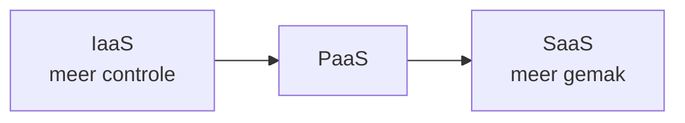

# Wat is de cloud?

De **cloud** is in essentie: **de servers van iemand anders**, die je over het internet huurt en betaalt naar gebruik. In plaats van zelf hardware te kopen en in een serverruimte te plaatsen, gebruik je de infrastructuur van een **cloudprovider** (AWS, Microsoft Azure, Google Cloud, DigitalOcean, Hetzner, …).

Cloud-diensten worden meestal ingedeeld in drie niveaus, naargelang **hoeveel** de provider voor jou beheert:

| Model | Jij beheert | Provider beheert | Voorbeeld |
|-------|-------------|------------------|-----------|
| **IaaS** (*Infrastructure as a Service*) | OS, software, applicatie | Hardware, netwerk, virtualisatie | **VPS**, AWS EC2 |
| **PaaS** (*Platform as a Service*) | Enkel je applicatiecode | OS, runtime, schaalbaarheid | Heroku, Vercel |
| **SaaS** (*Software as a Service*) | Niets (je gebruikt enkel) | Alles | Gmail, Microsoft 365 |

In deze cursus werken we met **IaaS** in de vorm van een **VPS** (*Virtual Private Server*): een **virtuele machine** die je volledig zelf beheert. Je hebt root-toegang, kiest het besturingssysteem en installeert wat je wilt. Dat is ideaal om te leren hoe deployment écht werkt.

:::tip[Afweging - OLR 12]

- **VPS**: maximale controle, maar ook maximale verantwoordelijkheid (updates, beveiliging, back-ups).
- **PaaS**: neemt werk uit handen, maar minder vrijheid en vaak duurder bij schaal.

Welke aanpak past, hangt af van je tech-stack, budget en team. We komen hierop terug bij de vergelijking van deployment-methodes.

:::
