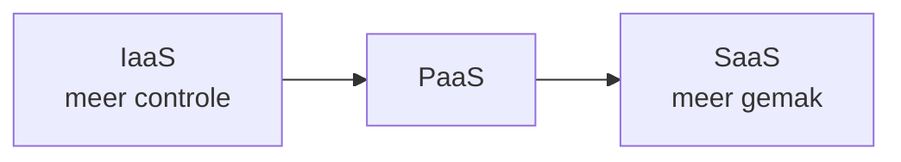

# Wat is de cloud?

De **cloud** is in essentie: **de servers van iemand anders**, die je over het internet huurt en betaalt naar gebruik. In plaats van zelf hardware te kopen en in een serverruimte te plaatsen, gebruik je de infrastructuur van een **cloudprovider** (AWS, Microsoft Azure, Google Cloud, DigitalOcean, Hetzner, …).

## Waarom de cloud?

Vroeger kocht een bedrijf eigen servers, zette ze in een eigen serverruimte en onderhield ze zelf. Dat is duur en log: je betaalt vooraf voor hardware die je misschien niet volledig gebruikt, en bij plotse drukte zit je vast aan wat je hebt. De cloud lost dat op met enkele kenmerken:

- **Betalen naar gebruik** (*pay-as-you-go*) — je betaalt per uur of per maand, en enkel voor wat je echt gebruikt.
- **On-demand** — je zet binnen enkele minuten een nieuwe server op, zonder hardware te bestellen.
- **Schaalbaarheid** (*elasticiteit*) — bij meer verkeer schaal je op, bij minder verkeer weer af. Je past de capaciteit aan de vraag aan.
- **Wereldwijd bereikbaar** — providers hebben **datacenters** in meerdere regio's, zodat je je server dicht bij je gebruikers kunt plaatsen (lagere vertraging).
- **Geen onderhoud aan hardware** — de provider zorgt voor de fysieke machines, stroom, koeling en netwerk.

## De drie servicemodellen

Cloud-diensten worden meestal ingedeeld in drie niveaus, naargelang **hoeveel** de provider voor jou beheert. Hoe hoger in de lijst, hoe meer je zelf in handen hebt (en hoe meer verantwoordelijkheid); hoe lager in de lijst, hoe meer gemak.

| Model | Jij beheert | Provider beheert | Voorbeeld |
|-------|-------------|------------------|-----------|
| **IaaS** (*Infrastructure as a Service*) | OS, software, applicatie | Hardware, netwerk, virtualisatie | **VPS**, AWS EC2 |
| **PaaS** (*Platform as a Service*) | Enkel je applicatiecode | OS, runtime, schaalbaarheid | Heroku, Vercel |
| **SaaS** (*Software as a Service*) | Niets (je gebruikt enkel) | Alles | Gmail, Microsoft 365 |

Een handige vergelijking met **vervoer**:

- **IaaS** = een auto huren — je rijdt en onderhoudt zelf, maar gaat waar je wilt.
- **PaaS** = een taxi — je zegt waar je heen wilt, de chauffeur rijdt.
- **SaaS** = het openbaar vervoer — vaste lijnen, jij stapt gewoon op.

## Publieke, private en hybride cloud

- **Publieke cloud** — gedeelde infrastructuur van een provider, voor iedereen toegankelijk (AWS, Azure …). Goedkoop en flexibel.
- **Private cloud** — infrastructuur exclusief voor één organisatie, bv. omwille van strenge privacy- of beveiligingseisen.
- **Hybride cloud** — een combinatie: gevoelige data privé, de rest publiek.

In deze cursus gebruiken we de **publieke cloud**.

## Onze keuze: een VPS (IaaS)

In deze cursus werken we met **IaaS** in de vorm van een **VPS** (*Virtual Private Server*): een **virtuele machine** die je volledig zelf beheert. Je hebt root-toegang, kiest het besturingssysteem en installeert wat je wilt. Dat is ideaal om te leren hoe deployment écht werkt - je ziet elke laag, van het besturingssysteem tot de webserver. Hoe je er een opzet, lees je in [Een cloud server (VPS) opzetten](./vps.md).

:::tip[Afweging - OLR 12]

- **VPS (IaaS)**: maximale controle, maar ook maximale verantwoordelijkheid (updates, beveiliging, back-ups).
- **PaaS**: neemt werk uit handen, maar biedt minder vrijheid en is vaak duurder bij schaal.

Welke aanpak past, hangt af van je tech-stack, budget en team. We komen hierop terug bij de vergelijking van deployment-methodes.

:::
