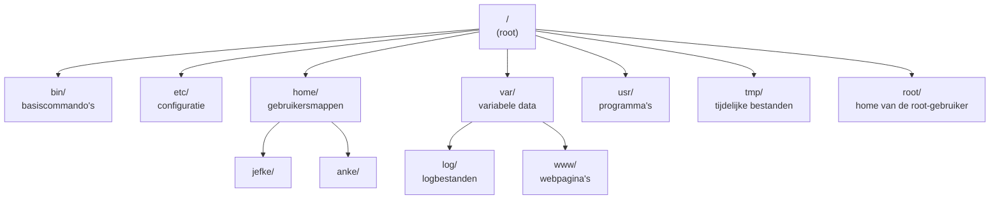

# Linux-basiscommando's (herhaling)

Een server beheer je doorgaans via een **terminal** zonder grafische interface - of je nu lokaal werkt of straks op je eigen server in de cloud. Een korte opfrissing van de commando's die je daarvoor nodig hebt. Het bestandssysteem is een **boom** die begint bij de root `/`. Je "huidige map" is je werkmap.

Deze pagina is bedoeld als **cheatsheet**: een overzicht dat je erbij houdt terwijl je oefent.

## Het bestandssysteem als boom

Alles begint bij de **root** `/`. Daaronder hangen vaste systeemmappen, elk met een eigen doel. Anders dan in Windows zijn er **geen schijfletters** (`C:`, `D:`): elke schijf of map hangt ergens in diezelfde ene boom.



| Map | Doel |
|-----|------|
| `/` | de **root** — de top van de hele boom |
| `/bin`, `/usr` | programma's en commando's |
| `/etc` | systeem- en serviceconfiguratie (bv. `/etc/ssh/sshd_config`) |
| `/home` | persoonlijke mappen van gebruikers (bv. `/home/jefke`) |
| `/root` | de home-map van de **root**-gebruiker (niet hetzelfde als `/`) |
| `/var` | data die verandert: logs (`/var/log`), webpagina's (`/var/www`) |
| `/tmp` | tijdelijke bestanden (worden geregeld opgeruimd) |

Je positie in die boom druk je uit met een **pad**.

## Paden: absoluut en relatief

Een **pad** geeft aan waar een bestand of map staat. Er zijn twee soorten:

- **Absoluut pad** — het volledige pad vanaf de root `/`. Voorbeeld: `/home/user/documenten/project.txt`
- **Relatief pad** — ten opzichte van je huidige map. `.` is de huidige map, `..` de bovenliggende. Voorbeeld: `./project.txt` of `../project.txt`

## Navigeren door het bestandssysteem

| Commando | Beschrijving | Voorbeeld |
|----------|--------------|-----------|
| `pwd` | *print working directory* — toont de huidige map | `pwd` |
| `cd map` | *change directory* — ga naar een map | `cd /home/user` |
| `cd ~` | ga naar je home-directory | `cd ~` |
| `cd ..` | ga één map omhoog | `cd ..` |
| `cd -` | ga terug naar de vorige map | `cd -` |
| `ls` | *list* — toon de inhoud van de map | `ls` |
| `ls -l` | gedetailleerde lijst (rechten, grootte, datum) | `ls -l` |
| `ls -a` | inclusief verborgen bestanden (beginnen met `.`) | `ls -la` |

## Bestanden en mappen beheren

| Commando | Beschrijving | Voorbeeld |
|----------|--------------|-----------|
| `mkdir naam` | *make directory* — maak een nieuwe map | `mkdir project` |
| `mkdir -p pad` | maak ook ontbrekende oudermappen aan | `mkdir -p a/b/c` |
| `touch bestand` | maak een leeg bestand (of werk de tijdstempel bij) | `touch notes.txt` |
| `cp bron doel` | *copy* — kopieer een bestand | `cp src.txt dst.txt` |
| `cp -r bron doel` | kopieer een map recursief (met inhoud) | `cp -r map/ backup/` |
| `mv bron doel` | *move* — verplaats of hernoem | `mv oud.txt nieuw.txt` |
| `rm bestand` | *remove* — verwijder een bestand | `rm oud.txt` |
| `rm -r map` | verwijder een map en alles erin | `rm -r map/` |
| `rm -f bestand` | forceer verwijderen (geen bevestiging) | `rm -f bestand` |

:::warning[Voorzichtig met `rm -rf`]

`rm -rf` verwijdert **onherroepelijk** een map met heel haar inhoud, zonder vragen te stellen. Er is geen prullenbak. Controleer altijd je pad voor je dit uitvoert - zeker met `sudo`.

:::

## Hulp bij commando's

| Commando | Beschrijving | Voorbeeld |
|----------|--------------|-----------|
| `man commando` | *manual* — toont de volledige handleiding | `man ls` |
| `commando --help` | korte hulp met de beschikbare opties | `ls --help` |

## Tekst bekijken en bewerken

| Commando | Beschrijving | Voorbeeld |
|----------|--------------|-----------|
| `cat bestand` | toon de inhoud van een bestand (of plak bestanden samen) | `cat file.txt` |
| `cat -n` | nummer alle regels | `cat -n file.txt` |
| `cat -b` | nummer enkel de niet-lege regels | `cat -b file.txt` |
| `head bestand` | toon de eerste 10 regels | `head file.txt` |
| `head -n aantal` | toon de eerste *aantal* regels | `head -n 3 file.txt` |
| `tail bestand` | toon de laatste 10 regels | `tail file.txt` |
| `tail -n aantal` | toon de laatste *aantal* regels | `tail -n 2 file.txt` |
| `tail -f bestand` | volg het bestand live (handig voor logs) | `tail -f /var/log/syslog` |
| `nano bestand` | bewerk in de eenvoudige editor `nano` | `nano file.txt` |
| `vi bestand` | bewerk in de editor `vi`/`vim` | `vi file.txt` |

:::tip[Werken met `nano`]

`nano` is een eenvoudige teksteditor in de terminal. Onderaan zie je de sneltoetsen: **`Ctrl + O`** om op te slaan (*write Out*, bevestig met Enter) en **`Ctrl + X`** om af te sluiten. Het `^`-teken in `nano` staat voor de `Ctrl`-toets.

:::

## Tekst filteren en verwerken

| Commando | Beschrijving | Voorbeeld |
|----------|--------------|-----------|
| `grep patroon bestand` | toon de regels die het patroon bevatten | `grep "hello" file.txt` |
| `grep -i` | zoek ongevoelig voor hoofdletters | `grep -i "hello" file.txt` |
| `grep -r` | zoek recursief in submappen | `grep -r "TODO" .` |
| `grep -v` | toon net de regels die **niet** matchen | `grep -v "debug" log.txt` |
| `cut -d sep -f velden` | haal kolommen/velden uit een regel | `cut -d "," -f 2 data.csv` |
| `sort bestand` | sorteer de regels alfabetisch | `sort namen.txt` |
| `sort -r` | sorteer omgekeerd | `sort -r namen.txt` |
| `sort -n` | sorteer numeriek | `sort -n getallen.txt` |
| `uniq` | verwijder opeenvolgende dubbele regels | `sort f.txt \| uniq` |
| `uniq -c` | tel hoe vaak elke regel voorkomt | `sort f.txt \| uniq -c` |
| `wc bestand` | tel regels, woorden en bytes | `wc file.txt` |
| `wc -l` / `-w` / `-c` | tel enkel regels / woorden / tekens | `wc -l file.txt` |
| `echo "tekst"` | druk een regel tekst af | `echo "Hallo"` |
| `echo -e` | interpreteer speciale tekens zoals `\n` | `echo -e "a\nb"` |

## Redirection en pipes

Met **redirection** stuur je de uitvoer (*stdout*) of de fouten (*stderr*) van een commando naar een bestand, of gebruik je een bestand als invoer (*stdin*).

| Operator | Beschrijving | Voorbeeld |
|----------|--------------|-----------|
| `>` | stdout naar bestand (**overschrijft**) | `echo "tekst" > bestand.txt` |
| `>>` | stdout naar bestand (**voegt toe**) | `echo "extra" >> bestand.txt` |
| `<` | lees stdin uit een bestand | `cat < bestand.txt` |
| `2>` | stderr naar bestand | `ls fout 2> fouten.log` |
| `&>` | stdout én stderr naar hetzelfde bestand | `commando &> uit.txt` |

Met een **pipe** (`|`) gebruik je de uitvoer van het ene commando als invoer voor het volgende:

```bash
ls -l | grep "test"      # zoek "test" in de uitvoer van ls -l
cat bestand.txt | sort   # sorteer de inhoud van bestand.txt
```

## Gebruikers en groepen

| Commando | Beschrijving | Voorbeeld |
|----------|--------------|-----------|
| `whoami` | toont als welke gebruiker je bent ingelogd | `whoami` |
| `id` | toont user-id, group-id en groepen | `id jefke` |
| `groups` | toont de groepen van een gebruiker | `groups jefke` |
| `su gebruiker` | start een shell als een andere gebruiker | `su jefke` |
| `sudo commando` | *superuser do* — voer uit met beheerdersrechten | `sudo id` |
| `sudo -u gebr. commando` | voer uit als een specifieke gebruiker | `sudo -u jefke touch /home/jefke/test` |
| `passwd gebruiker` | wijzig het wachtwoord van een gebruiker | `passwd jefke` |

Gebruikers en groepen aanmaken of aanpassen (meestal met `sudo`):

| Commando | Beschrijving | Voorbeeld |
|----------|--------------|-----------|
| `useradd -m -s shell naam` | maak een gebruiker; `-m` home-map, `-s` shell | `sudo useradd -m -s /bin/bash jefke` |
| `adduser naam` | gebruiksvriendelijker alternatief, vraagt meteen een wachtwoord | `sudo adduser jefke` |
| `userdel -r naam` | verwijder een gebruiker; `-r` ook de home-map | `sudo userdel -r jefke` |
| `groupadd naam` | maak een groep | `sudo groupadd admin` |
| `groupdel naam` | verwijder een groep | `sudo groupdel admin` |
| `usermod -l nieuw oud` | hernoem een gebruiker | `sudo usermod -l jef jefke` |
| `usermod -d map naam` | stel een nieuwe home-map in | `sudo usermod -d /data/jefke jefke` |
| `usermod -aG groepen naam` | voeg een gebruiker toe aan groepen | `sudo usermod -aG sudo,docker jefke` |
| `groupmod -n nieuw oud` | hernoem een groep | `sudo groupmod -n beheer admin` |

:::tip[Een gebruiker aan een groep toevoegen]

Lidmaatschap van een groep stel je in via de **gebruiker**, niet via `groupmod`. Gebruik `usermod -aG groep gebruiker` (de `-a` is belangrijk: *append*, anders overschrijf je de bestaande groepen) of `gpasswd -a gebruiker groep`.

:::

## Rechten: `chmod` en `chown`

Elk bestand heeft rechten voor drie categorieën — **eigenaar** (`u`), **groep** (`g`) en **overige** (`o`) — met telkens **lezen** (`r`), **schrijven** (`w`) en **uitvoeren** (`x`).

`chmod` wijzigt die rechten. Dat kan met **cijfers** of met **letters**.

**Cijfernotatie** — tel per categorie op:

| Cijfer | Recht |
|--------|-------|
| `4` | lezen (`r`) |
| `2` | schrijven (`w`) |
| `1` | uitvoeren (`x`) |

```bash
chmod 755 script.sh   # eigenaar: rwx (7), groep en overige: r-x (5)
chmod 644 file.txt    # eigenaar: rw- (6), groep en overige: r-- (4)
```

**Letternotatie** — met `u`/`g`/`o`/`a` (all) en `+`/`-`:

```bash
chmod u+x,g-w file.txt   # eigenaar krijgt uitvoerrecht, groep verliest schrijfrecht
chmod a+r file.txt       # iedereen mag lezen
```

`chown` verandert de **eigenaar** en/of **groep** van een bestand of map:

```bash
sudo chown jefke:admin bestand.txt   # eigenaar -> jefke, groep -> admin
sudo chown jefke bestand.txt         # enkel de eigenaar
sudo chown :admin bestand.txt        # enkel de groep
sudo chown -R jefke:admin map/       # recursief, inclusief alle inhoud
```

## Processen

Een **proces** is een draaiend programma, herkenbaar aan zijn **PID** (proces-id).

| Commando | Beschrijving | Voorbeeld |
|----------|--------------|-----------|
| `ps` | toon actieve processen | `ps afux` |
| `pstree -p` | toon processen als boom, met PID | `pstree -p` |
| `kill PID` | stop een proces (standaard `SIGTERM`) | `kill 1234` |
| `kill -9 PID` | forceer stoppen (`SIGKILL`, geen cleanup) | `kill -9 1234` |
| `kill -l` | lijst alle signalen | `kill -l` |
| `pgrep -u gebruiker` | zoek processen van een gebruiker | `pgrep -au jefke` |
| `pkill naam` | stop processen op naam | `pkill -9 firefox` |
| `jobs` | toon actieve/gepauzeerde taken in deze shell | `jobs` |
| `fg %n` | hervat taak `n` in de **voorgrond** | `fg %1` |
| `bg %n` | hervat taak `n` in de **achtergrond** | `bg %1` |
| `commando &` | start een commando meteen in de achtergrond | `./script.sh &` |

## Archiveren en comprimeren

| Commando | Beschrijving | Voorbeeld |
|----------|--------------|-----------|
| `tar -cvf archief.tar ...` | maak een archief (*create*) | `tar -cvf back.tar map/` |
| `tar -xvf archief.tar` | pak een archief uit (*extract*) | `tar -xvf back.tar` |
| `gzip bestand` | comprimeer (geeft `.gz`) | `gzip file.txt` |
| `gunzip bestand.gz` | decomprimeer een `.gz` | `gunzip file.txt.gz` |
| `bzip2 bestand` | comprimeer sterker (geeft `.bz2`) | `bzip2 file.txt` |
| `bunzip2 bestand.bz2` | decomprimeer een `.bz2` | `bunzip2 file.txt.bz2` |

## Systeem en pakketten

Op Ubuntu installeer je software met **`apt`**. Veel beheertaken vereisen **`sudo`** (*superuser do*, tijdelijke beheerdersrechten):

```bash
sudo apt update            # pakketlijst verversen
sudo apt install nginx     # software installeren
```

De bijbehorende oefeningen vind je op de pagina [Oefeningen: Linux-basiscommando's](./linux-oefeningen.md).
