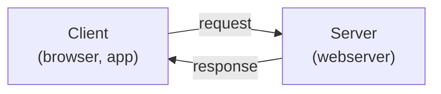

# Wat is een server?

Een **server** is een computer (of programma) die **diensten aanbiedt** aan andere computers, de **clients**. De client stuurt een **verzoek** (request), de server stuurt een **antwoord** (response). Dit heet het **client-servermodel**.

Het woord "server" heeft twee betekenissen:

- **Hardware** - de fysieke (of virtuele) machine die altijd aanstaat en bereikbaar is.
- **Software** - het programma dat op die machine draait en verzoeken beantwoordt (bv. **nginx** of **Apache** als webserver).

Veelvoorkomende soorten servers:

| Type server | Rol | Voorbeeld-software |
|-------------|-----|--------------------|
| **Webserver** | Levert webpagina's via HTTP(S) | nginx, Apache, Caddy |
| **Databaseserver** | Slaat data op en bevraagt ze | PostgreSQL, MySQL |
| **DNS-server** | Vertaalt domeinnamen naar IP | BIND, dnsmasq |
| **Mailserver** | Verstuurt en ontvangt e-mail | Postfix, Dovecot |

Een server verschilt van een gewone pc vooral in **gebruik**: hij is bedoeld om **continu** beschikbaar te zijn, vaak zonder beeldscherm, en je beheert hem op afstand via **SSH**.
