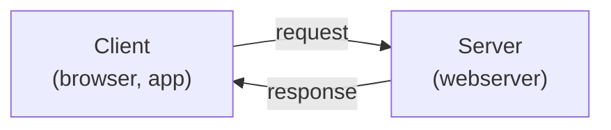
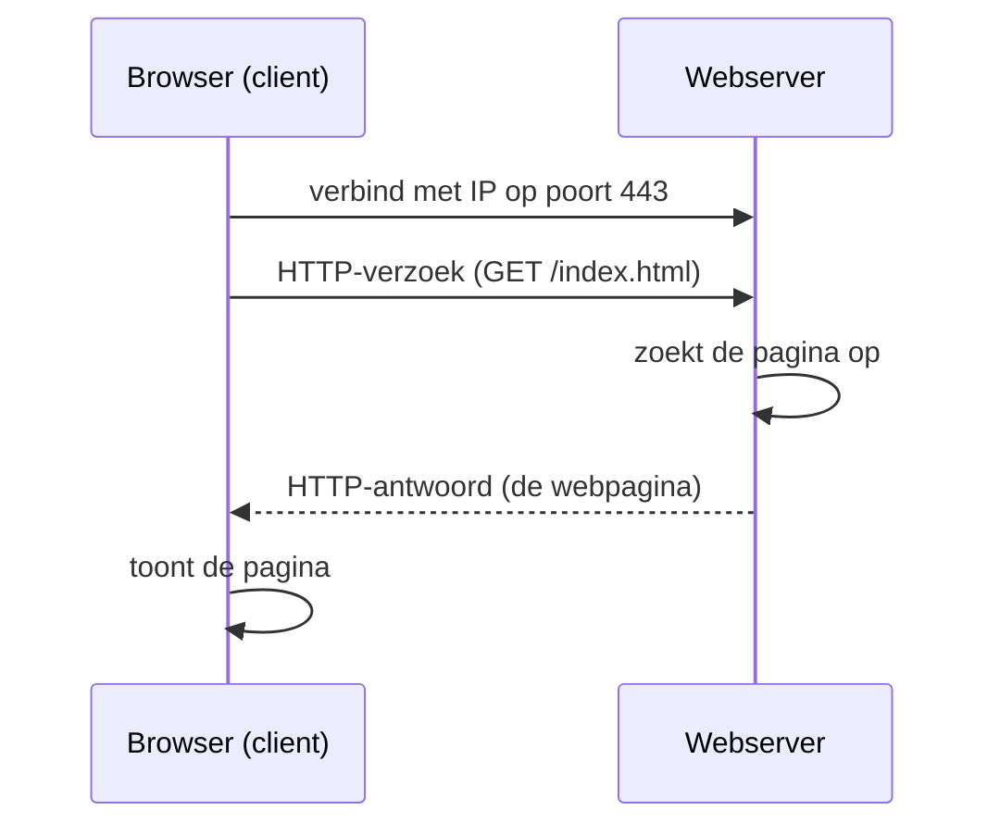

# Wat is een server?

Een **server** is een computer (of programma) die **diensten aanbiedt** aan andere computers, de **clients**. De client neemt het initiatief en stuurt een **verzoek** (request); de server **wacht** op zulke verzoeken en stuurt telkens een **antwoord** (response) terug. Dit heet het **client-servermodel** en het zit achter zowat alles wat je online doet: een website bezoeken, een mail ophalen, een game spelen.

## Het client-servermodel (request ↔ response)

Het verschil zit in de **rol**, niet in het soort machine:

- De **client** start de communicatie. Hij weet *wat* hij wil en *waar* hij het kan halen (een adres). Voorbeelden: je browser, een mailprogramma, een smartphone-app.
- De **server** is **passief**: hij staat klaar en reageert pas wanneer er een verzoek binnenkomt. Daarom moet hij **continu bereikbaar** zijn.

Eenzelfde toestel kan trouwens beide rollen spelen. Een webserver die zelf een databank bevraagt, is op dat moment **client** van de databaseserver.

## Een verzoek van begin tot eind: HTTP-protocol als voorbeeld

Wat gebeurt er concreet als je naar een website surft? De client en de server vinden elkaar dankzij twee dingen die je in het [TCP/IP-model](./tcp-ip-model.md) zag: een **IP-adres** (welke machine) en een **poort** (welk programma op die machine).

De server doet dus telkens hetzelfde rondje: **ontvangen → verwerken → antwoorden**, en wacht daarna op het volgende verzoek.

:::note[Niet alleen HTTP]

Dit voorbeeld gebruikt **HTTP**, maar het client-servermodel staat **los van één protocol**. Hetzelfde patroon (verbinden → vragen → antwoorden) geldt voor heel wat andere protocollen, elk met hun eigen poort:

- **SSH** (poort 22) om in te loggen op een server
- **SMTP / IMAP** voor het versturen en ophalen van e-mail
- **DNS** (poort 53) om domeinnamen op te zoeken
- **FTP** voor bestandsoverdracht

Een browser spreekt HTTP, maar een mailprogramma, een SSH-client of een database-client volgen exact dezelfde client-serverlogica over hún protocol.

:::

## Eén server, veel clients

Een server bedient zelden maar één client. Een populaire webserver beantwoordt **honderden tot duizenden verzoeken per seconde**, van veel verschillende clients tegelijk. Daarom telt voor een server vooral **betrouwbaarheid en beschikbaarheid**: hij moet blijven draaien, ook 's nachts en ook als er veel verkeer is.

## Server = hardware én software

Het woord "server" heeft twee betekenissen, en die werken samen:

- **Hardware** — de fysieke (of virtuele) machine die altijd aanstaat en bereikbaar is.
- **Software** — het programma dat op die machine draait en verzoeken beantwoordt (bv. **nginx** of **Apache** als webserver).

Op **één** machine kunnen **meerdere serverprogramma's tegelijk** draaien. Ze blijven uit elkaar dankzij hun **poort**: een webserver luistert op poort 80/443, een SSH-dienst op poort 22, een databank op nog een andere. Het IP-adres brengt het verzoek bij de juiste machine, de poort bij het juiste programma.

## Fysiek of virtueel

Een server hoeft geen aparte fysieke kast te zijn. Met **virtualisatie** draaien er meerdere **virtuele servers** (VM's) op één fysieke machine, elk met een eigen besturingssysteem, alsof het aparte computers zijn. Net dat maakt de **cloud** mogelijk: je huurt zo'n virtuele server in plaats van zelf hardware te kopen. In deze cursus werk je daarom met een **VPS** - zie [Wat is de cloud?](./cloud.md) en [Virtual Private Server](./vps.md).

## Server vs. gewone pc

Een server verschilt van een gewone pc vooral in **gebruik**: hij draait meestal **zonder beeldscherm of toetsenbord** (*headless*) en je beheert hem **op afstand** via [SSH](./ssh.md).

:::info[Leerdoel - OLR 04]

Je kan nu **uitleggen wat een server is** en **hoe een client met een server communiceert** via het request-responsemodel. Dat is de basis om straks zelf een server (VPS) op te zetten en er een webpagina op te deployen.

:::
