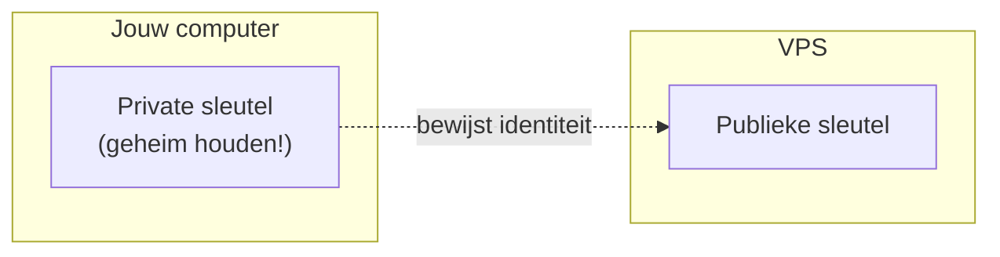

# SSH: veilig inloggen op je server

**SSH** (*Secure Shell*) is het protocol om **versleuteld** in te loggen op een server op afstand en daar commando's uit te voeren. Het draait standaard op **poort 22**. Alles wat je typt en wat de server terugstuurt, is versleuteld - niemand op het netwerk kan meelezen.

## Inloggen: met wachtwoord of met een sleutelpaar

Inloggen kan op twee manieren:

- **Met wachtwoord** - eenvoudig, maar kwetsbaar voor brute-force-aanvallen.
- **Met een SSH-sleutelpaar** - een **publieke** sleutel (op de server) en een **private** sleutel (op jouw computer, geheim). Veel veiliger en de aanbevolen methode.

## Hoe sleutelauthenticatie werkt



Bij sleutelauthenticatie blijft je **private** sleutel altijd op je eigen computer - hij wordt **nooit** over het netwerk verstuurd. Bij het inloggen bewijs je met die private sleutel dat je de bijhorende **publieke** sleutel bezit, en zo kom je binnen zonder wachtwoord.

## Sleutelauthenticatie stap voor stap

De volledige flow ziet er zo uit:

1. **Sleutelpaar aanmaken** op je eigen computer (eenmalig):

   ```bash
   ssh-keygen -t ed25519 -C "jouw.naam@school.be"
   ```

   Dit maakt twee bestanden aan: `~/.ssh/id_ed25519` (private - **nooit delen**) en `~/.ssh/id_ed25519.pub` (publiek).

2. **Publieke sleutel op de server zetten** - via de provider (VPS-stap 3) of met `ssh-copy-id gebruiker@IP`. De sleutel komt terecht in `~/.ssh/authorized_keys` op de server.

3. **Aanmelden** op de server:

   ```bash
   ssh root@203.0.113.10
   ```

4. **De eerste keer** vraagt SSH of je de server vertrouwt en toont de *host key fingerprint*. Bevestig met `yes`: de host key wordt opgeslagen in `~/.ssh/known_hosts` op jouw computer. Bij volgende logins verloopt het verbinden zonder die vraag. Daarna zit je in de **shell** van de server.

## Twee bestanden met een sleutelrol

Twee bestanden spelen dus een sleutelrol:

- **`~/.ssh/authorized_keys` (op de server)** - bevat jouw **publieke** sleutel(s); zo weet de server wie mag inloggen.
- **`~/.ssh/known_hosts` (op jouw computer)** - bevat de **host key** van servers waarmee je al verbond; zo herkent SSH de server bij een volgende login en **waarschuwt** het als die plots wijzigt (bv. een mogelijke man-in-the-middle).

Kort samengevat: `authorized_keys` zegt de **server** wie binnen mag, `known_hosts` zegt **jou** met welke server je praat.

:::warning[Beveiliging - OLR 13]

Schakel **wachtwoordlogin uit** zodra sleutelauthenticatie werkt (`PasswordAuthentication no` in `/etc/ssh/sshd_config`). Log in productie niet rechtstreeks in als `root`, maar maak een aparte gebruiker met `sudo`-rechten. Onversleutelde toegang (zoals het oude Telnet) is in een productieomgeving onaanvaardbaar.

:::
