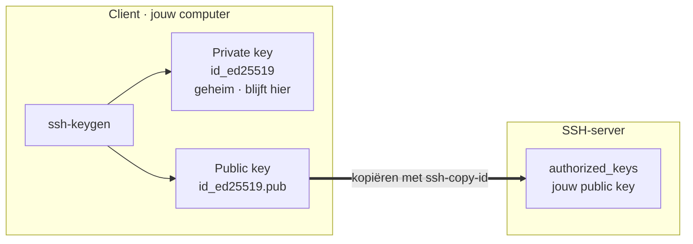
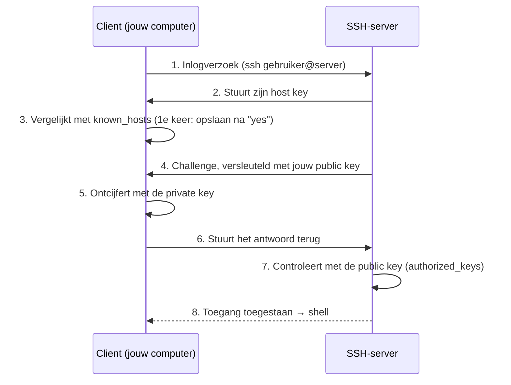

# SSH: veilig inloggen op je server

**SSH** (*Secure Shell*) is het protocol om **versleuteld** in te loggen op een server op afstand en daar commando's uit te voeren. Het draait standaard op **poort 22**. Alles wat je typt en wat de server terugstuurt, is versleuteld — niemand op het netwerk kan meelezen.

## Inloggen: met wachtwoord of met een key pair

Inloggen kan op twee manieren:

- **Met wachtwoord** — eenvoudig, maar kwetsbaar voor brute-force-aanvallen.
- **Met een SSH-key pair** — een **public key** (op de server) en een **private key** (op jouw computer, geheim). Veel veiliger en de aanbevolen methode.

## Public en private key: de theorie

Een wachtwoord is **één gedeeld geheim** dat jij én de server kennen — onderschept iemand het, dan kan die inloggen. Sleutelauthenticatie vermijdt dat gedeelde geheim met **asymmetric cryptography**: je gebruikt een **key pair** — twee keys die bij elkaar horen en elkaars tegenhanger zijn.

- De **public key** mag iedereen kennen. Je plaatst hem op elke server waarop je wilt inloggen.
- De **private key** blijft **geheim** op jouw eigen computer. Je deelt hem met niemand.

De clou: de twee keys werken **samen, maar in tegengestelde richting**. Wat met de **public key** wordt **vergrendeld** (versleuteld), kan enkel met de bijhorende **private key** weer worden **ontgrendeld** (ontcijferd). Eén key alleen volstaat dus nooit — je hebt altijd de andere nodig om het werk ongedaan te maken.

Belangrijk: uit de public key kun je de private key **niet** berekenen. Daarom is het veilig om je public key overal achter te laten — enkel jij, met de private key, kunt ontgrendelen wat ermee vergrendeld is.

:::tip[Vergelijking: het hangslot]

Zie je **public key** als een **open hangslot** dat je gerust mag uitdelen. Iedereen kan er een doosje mee dichtklikken, maar enkel jij hebt het **sleuteltje** - je **private key** - om het weer te openen. Het hangslot rondstrooien is dus geen probleem; het sleuteltje houd je angstvallig bij jou.

:::

## Vooraf: je keys instellen (eenmalig)

Voordat je met keys kunt inloggen, doe je deze voorbereiding **één keer**: je maakt het key pair aan op **je eigen computer (de client)** en kopieert enkel de **public key** naar de **server waarop SSH draait**, in het bestand `authorized_keys`. Je **private key** blijft altijd op de client.



1. **Key pair aanmaken** op je eigen computer:

   ```bash
   ssh-keygen -t ed25519 -C "jouw.naam@school.be"
   ```

   Dit maakt twee bestanden aan: `~/.ssh/id_ed25519` (private key — **nooit delen**) en `~/.ssh/id_ed25519.pub` (public key).

2. **Public key op de server zetten** — via je cloudprovider bij het aanmaken van de server (zie [VPS](./vps.md)) of met `ssh-copy-id gebruiker@IP`. De public key komt terecht in `~/.ssh/authorized_keys` op de server.

Daarna staat je public key klaar op de server; deze voorbereiding herhaal je niet meer.

:::note[Let op]

Jouw **public key** gaat naar **`authorized_keys` op de server** — níét naar `known_hosts`. Wat `known_hosts` precies is, zie je hieronder bij [het inloggen](#twee-bestanden-met-een-sleutelrol).

:::

## Hoe het inloggen verloopt (telkens je verbindt)

Bij elke verbinding gebeuren er **twee controles**: je client controleert eerst de **identiteit van de server** (via de *host key* in `known_hosts`), en daarna bewijs jij je **eigen identiteit** met je private key (via een *challenge-response*). Je private key wordt daarbij **nooit** verstuurd.



Aanmelden doe je met:

```bash
ssh gebruiker@<public ip>
```

**De server identificeren — `known_hosts`.** De eerste keer toont SSH de *host key fingerprint* van de server en vraagt of je hem vertrouwt. Bevestig met `yes`: de host key komt in `~/.ssh/known_hosts` op jouw computer. Bij volgende logins vergelijkt SSH de host key telkens met `known_hosts` en **waarschuwt** als die plots wijzigt — een mogelijke man-in-the-middle.

**Jezelf bewijzen — `authorized_keys`.** De server versleutelt een willekeurige **challenge** met jouw public key (uit `authorized_keys`). Alleen wie de bijhorende **private key** heeft, kan die ontcijferen en het juiste antwoord terugsturen. Zo bewijs je je identiteit zonder dat je private key je computer verlaat — veiliger dan een wachtwoord, want er gaat geen geheim over de lijn dat onderschept of geraden kan worden.

### Twee bestanden met een sleutelrol

Kort samengevat spelen twee bestanden de hoofdrol bij dit alles:

- **`~/.ssh/authorized_keys` (op de server)** — bevat jouw **public key(s)**; zegt de server **wie** mag inloggen.
- **`~/.ssh/known_hosts` (op jouw computer)** — bevat de **host key** van servers waarmee je al verbond. Zo controleert SSH bij elke login of je nog met **dezelfde** server praat, en waarschuwt als de host key plots wijzigt — een mogelijke **man-in-the-middle** of nagemaakte server.

## SSH- en SCP-commando's

Naast inloggen kun je via SSH ook **bestanden overzetten** met **SCP** (*Secure Copy*): kopiëren over dezelfde versleutelde verbinding. De **richting** van het commando bepaalt of je up- of downloadt.

### SSH: verbinden

| Commando | Uitleg |
|----------|--------|
| `ssh gebruiker@server` | Verbind met de server als `gebruiker`. |
| `ssh gebruiker@server "ls -la"` | Verbind en voer meteen één commando uit, zonder een interactieve shell te openen. |

### SSH: keys

| Commando | Uitleg |
|----------|--------|
| `ssh-keygen -t ed25519 -f ~/.ssh/id_ed25519` | Genereer een Ed25519-key pair en sla het op onder een opgegeven bestandsnaam. |
| `ssh-copy-id -i ~/.ssh/id_ed25519.pub gebruiker@server` | Kopieer een specifieke public key naar de server, zodat je zonder wachtwoord kunt inloggen. |
| `ssh -i ~/.ssh/id_ed25519 gebruiker@server` | Verbind met een specifieke private key in plaats van de standaard key. |

### SCP: uploaden (naar de server)

| Commando | Uitleg |
|----------|--------|
| `scp file.txt gebruiker@server:/data` | Upload `file.txt` naar de map `/data` op de server. |
| `scp file1.txt file2.txt gebruiker@server:/data` | Upload meerdere bestanden tegelijk. |
| `scp -r map/ gebruiker@server:/home/gebruiker/` | Kopieer een volledige map **recursief** naar de server. |

### SCP: downloaden (van de server)

| Commando | Uitleg |
|----------|--------|
| `scp gebruiker@server:/home/gebruiker/file.txt .` | Download `file.txt` naar je huidige lokale map (`.`). |
| `scp gebruiker@server:/data/file1.txt gebruiker@server:/data/file2.txt .` | Download meerdere bestanden tegelijk. |
| `scp -r gebruiker@server:/home/gebruiker/map/ .` | Kopieer een volledige map **recursief** van de server. |

### SCP: poort en key

| Commando | Uitleg |
|----------|--------|
| `scp -P 2222 file.txt gebruiker@server:/data` | Upload via een aangepaste SSH-poort. |
| `scp -i ~/.ssh/id_ed25519 file.txt gebruiker@server:/data` | Upload met authenticatie via een specifieke private key. |

:::note[`-p` of `-P`?]

`ssh` gebruikt voor een andere poort de **kleine** letter (`ssh -p 2222 ...`), maar `scp` gebruikt de **hoofdletter** (`scp -P 2222 ...`). Een klassieke valstrik.

:::

:::warning[Beveiliging - OLR 13]

Schakel **wachtwoordlogin uit** zodra key-authenticatie werkt (`PasswordAuthentication no` in `/etc/ssh/sshd_config`). Log in productie niet rechtstreeks in als `root`, maar maak een aparte gebruiker met `sudo`-rechten. Onversleutelde toegang (zoals het oude Telnet) is in een productieomgeving onaanvaardbaar.

:::
