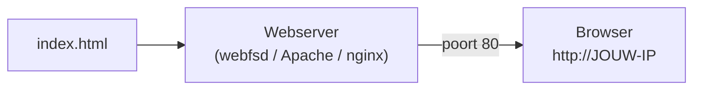

# Een statische webpagina deployen

Een **statische webpagina** is een vast bestand (HTML, CSS, afbeeldingen) dat de server ongewijzigd terugstuurt - geen databank of servercode nodig. Dat maakt het de ideale eerste deployment. Je hebt drie eenvoudige opties. Kies er één.



## Optie A - `webfsd` (lichtgewicht, snel testen)

`webfsd` is een minimale webserver, ideaal om snel iets te tonen:

```bash
sudo apt update
sudo apt install webfs                 # levert het commando 'webfsd'
mkdir ~/site
echo "<h1>Hallo vanaf mijn VPS</h1>" > ~/site/index.html
webfsd -p 80 -r ~/site -f index.html   # -p poort, -r root-map, -f standaardbestand
```

Open in je browser `http://JOUW-IP`. Stop de server met `Ctrl + C`.

## Optie B - nginx

**nginx** is een veelgebruikte productie-webserver. Na installatie draait hij meteen en serveert hij bestanden uit `/var/www/html`:

```bash
sudo apt update
sudo apt install nginx
# Vervang de standaardpagina:
sudo nano /var/www/html/index.html
```

Typ je eigen HTML, sla op (`Ctrl + O`, Enter) en sluit af (`Ctrl + X`). nginx draait als **service**:

```bash
sudo systemctl status nginx     # draait hij?
sudo systemctl restart nginx    # herstart na configuratiewijziging
```

## Optie C - Apache

**Apache** (`apache2` op Ubuntu) werkt volgens hetzelfde principe. Ook hier staat de webroot in `/var/www/html`:

```bash
sudo apt update
sudo apt install apache2
sudo nano /var/www/html/index.html
sudo systemctl restart apache2
```

## Verifiëren

Controleer of je pagina bereikbaar is - dit hoort bij *OLR 07*:

```bash
curl http://localhost          # vanaf de server zelf
curl http://JOUW-IP            # of open het IP in je browser
```

Krijg je geen antwoord? Doorloop de [troubleshooting](./troubleshooting.md).

:::warning[Firewall en poort 80]

Als je server niet bereikbaar is van buitenaf, staat poort **80** mogelijk dicht. Open hem in de firewall van je provider én lokaal:

```bash
sudo ufw allow 80/tcp
sudo ufw allow 22/tcp      # sluit jezelf niet buiten!
```

Op een verse Ubuntu-server staat `ufw` vaak nog **uit**. Open dan éérst poort 22 (SSH) en activeer pas daarna de firewall met `sudo ufw enable` - anders sluit je je eigen SSH-verbinding af.

:::
