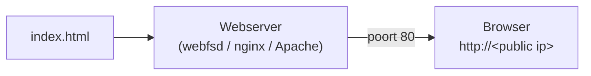

# Een statische webpagina

Een **statische webpagina** is een vast bestand (HTML, CSS, afbeeldingen) dat de server ongewijzigd terugstuurt - geen databank of servercode nodig. Dat maakt het de ideale eerste deployment.

## Veelgebruikte webservers

Een **webserver** is het programma dat je webpagina *served*: het stuurt het juiste bestand naar de browser van elke bezoeker die erom vraagt. Er bestaan er veel (Caddy, LiteSpeed, Microsoft IIS …); hieronder lichten we drie veelgebruikte keuzes op een Linux-server uit:

| Webserver | Type | Webroot | Wanneer |
|-----------|------|---------|---------|
| `webfsd` | minimale, lichtgewicht server (geen service) | map naar keuze (bv. `~/site`) | snel iets tonen of even testen |
| **nginx** | veelgebruikte productie-webserver (draait als service) | `/var/www/html` | echte deployment, hoge belasting |
| **Apache** (`apache2`) | klassieke productie-webserver (draait als service) | `/var/www/html` | echte deployment, brede module-ondersteuning |

Het principe is bij alle drie hetzelfde: je plaatst een `index.html` in de **webroot** en de server levert die uit op **poort 80**. `webfsd` start je zelf in een terminal; **nginx** en **Apache** draaien als **service** die na installatie meteen actief is.

In de oefeningen gebruiken we **nginx** als voorbeeld. Wil je liever `webfsd` of Apache gebruiken, zoek dan zelf op hoe je daarmee je pagina online zet - het principe (pagina in de webroot, poort 80) blijft hetzelfde.
