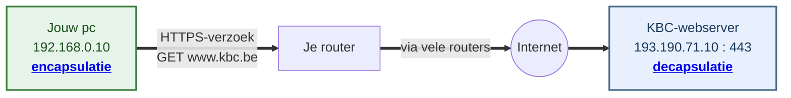
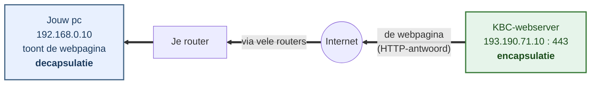

# Het TCP/IP-model (herhaling)

Wanneer twee computers over een netwerk praten, gebeurt dat niet in één grote stap maar in **lagen**. Elke laag heeft een eigen verantwoordelijkheid en praat enkel met de laag erboven en eronder. Dit **gelaagde model** maakt netwerken beheersbaar: je kunt één laag aanpassen (bv. van wifi naar kabel) zonder de rest te herschrijven.

In deze cursus gebruiken we het **TCP/IP-model in vijf lagen**. Dit is een veelgebruikte variant die de onderste laag opsplitst in een **datalink-** en een **fysieke** laag. Dit is handig omdat MAC-adressering (datalink) en het effectieve signaal op de kabel (fysiek) duidelijk gescheiden worden. Het oudere **OSI-model** (zeven lagen) zie je vooral in theorie. De mapping staat in de laatste kolom.

| # | TCP/IP-laag (5) | Taak | Protocollen | Adressering (bron → bestemming) | Eenheid | OSI |
|---|-----------------|------|-------------|---------------------------------|---------|-----|
| 1 | **Fysiek** | Bits als signaal versturen (spanning, licht, radio) | kabel, glasvezel, radiogolven | - (geen adressering) | bits | 1 |
| 2 | **Datalink** | Fysieke adressering (MAC), frames over de link | Ethernet, wifi (802.11) | bron-**MAC** → bestemmings-**MAC** | frame | 2 |
| 3 | **Netwerk** | Logische adressering en routering tussen netwerken | **IP** (IPv4/IPv6), ICMP | bron-**IP** → bestemmings-**IP** | pakket | 3 |
| 4 | **Transport** | Betrouwbaarheid, poorten, segmentatie | **TCP**, **UDP** | bron**poort** → bestemmings**poort** | segment | 4 |
| 5 | **Applicatie** | Communicatie tussen programma's | HTTP, HTTPS, DNS, SSH, FTP | - | data / bericht | 5-7 |

Hieronder kort wat elke laag doet, van onder (de fysieke verbinding) naar boven (dichtst bij de gebruiker).

## Fysieke laag (laag 1)

De onderste laag verstuurt de **bits** (enen en nullen) als een echt **signaal** over een fysiek medium. Hoe dat signaal eruitziet, hangt af van het medium:

- **koperkabel** (UTP, Ethernet) - als elektrische spanning
- **glasvezel** - als lichtpulsen
- **wifi** - als radiogolven door de lucht

De laag **begrijpt de bits niet**, maar brengt ze van punt A naar punt B. Ook **bandbreedte** (bits per seconde) speelt op dit niveau.

## Datalinklaag (laag 2)

Deze laag verzorgt het transport over **één lokale verbinding** (LAN), bijvoorbeeld alle toestellen op hetzelfde wifi-netwerk of dezelfde switch. Ze groepeert de bits in **frames** en gebruikt **MAC-adressen** om binnen dat lokale netwerk de juiste **netwerkkaart** aan te spreken.

- Een **MAC-adres** (bv. `00:1A:2B:3C:4D:5E`) is een uniek, in de netwerkkaart ingebakken hardware-adres. Het wordt **hexadecimaal** geschreven: 6 groepjes van 2 tekens (0-9 en A-F), samen 48 bits.
- Een **switch** werkt op deze laag: hij stuurt frames door naar de juiste poort op basis van het MAC-adres.

Belangrijk: de datalinklaag raakt **niet voorbij het lokale netwerk**. Om een ander netwerk te bereiken, is de netwerklaag nodig.

## Netwerklaag (laag 3)

Terwijl de datalinklaag binnen één netwerk blijft, zorgt de netwerklaag dat data **over de grenzen van netwerken heen** raakt - dwars door het internet. Ze werkt met **IP-adressen** (logische adressen) en met **routering**.

- Een **IP-adres** (bv. `93.184.216.34` in IPv4, of een langer IPv6-adres) identificeert een **machine** waar ook ter wereld.
- **Routers** geven een **pakket** stap voor stap (hop per hop) door, telkens een stukje dichter bij de bestemming. Elke router kiest de volgende stap op basis van het bestemmings-IP.
- **DNS** vertaalt een leesbare domeinnaam (`example.com`) naar een IP-adres (zie [hoofdstuk 2](../hoofdstuk-2-dns.md)).

De netwerklaag biedt **geen garanties** dat alles aankomt - dat is net de taak van de transportlaag erboven. Samen bepalen **IP-adres + poort** aan beide kanten precies één verbinding.

## Transportlaag (laag 4)

De netwerklaag bezorgt data bij de juiste **machine**. De transportlaag gaat verder: ze brengt de data bij het juiste **programma** (via poorten) en zorgt - bij TCP - dat alles **volledig en in volgorde** aankomt. Grote data wordt in **segmenten** geknipt en aan de andere kant weer samengevoegd.

### Waarom heb je een poort nodig? 

Op één machine draaien meestal **meerdere programma's tegelijk**: bv. een webserver, een SSH-dienst en een database. Een **IP-adres** brengt data wel bij de juiste machine, maar niet bij het juiste programma. Dat doet de **poort**: het "huisnummer" binnen de machine.

> Vergelijking: het **IP-adres** is het adres van het *gebouw*, de **poort** is het *bureau- of busnummer* binnen dat gebouw. Zonder busnummer weet de postbode niet bij wie de brief moet.

Een **poortnummer** (16 bits, 0-65535) zegt dus voor welk programma een segment bedoeld is. Bij elke verbinding spelen er altijd **twee** poorten mee. Elk pakket draagt een **bronpoort** (van wie het komt) en een **bestemmingspoort** (waar het heen moet).

Belangrijk: *bron* en *bestemming* zijn **labels die afhangen van de richting** van het pakket. Wat wél vastligt, is de **rol** van elke kant: de server-dienst luistert op een **vaste** poort, jouw toestel gebruikt een **tijdelijke** poort.

### Bestemmingspoort

De **bestemmingspoort** is de poort waar een pakket naartoe moet.

### Bronpoort

De **bronpoort** is de poort van waaruit een pakket vertrekt.

Die bronpoort dient twee doelen:

- **Het antwoord vindt de weg terug.** De server gebruikt jouw bronpoort als bestemming voor zijn antwoord: hij stuurt het naar jouw IP-adres op poort 54123. Zo komt het bij het juiste programma op jouw toestel terecht.
- **Meerdere verbindingen tegelijk blijven uit elkaar.** Open je twee tabbladen naar dezelfde site, dan gebruikt elk tabblad een **andere** bronpoort. Het IP-adres en de bestemmingspoort (443) zijn identiek, maar dankzij de unieke bronpoort weet je toestel welk antwoord bij welk tabblad hoort.

### Bron en bestemming wisselen om per richting

Een verbinding bestaat uit verkeer in **twee richtingen**, en bij het antwoord **wisselen** bron en bestemming gewoon van plaats:

| Richting | Bronpoort | Bestemmingspoort |
|----------|-----------|------------------|
| **Heenweg** (jouw pc → KBC-server) | 54123 (jouw tijdelijke poort) | 443 (https) |
| **Terugweg** (KBC-server → jouw pc) | 443 (https) | 54123 (jouw tijdelijke poort) |

De **nummers** zelf veranderen niet - wél welk nummer op dat moment het label "bron" of "bestemming" draagt. Dat hangt af van **wie verstuurt**. Poort 443 is dus geen "bestemmingspoort" op zich: het is de **vaste dienstpoort** van de server.

### Twee protocollen: TCP en UDP

Het grote verschil is *betrouwbaarheid versus snelheid*.

| | **TCP** | **UDP** |
|--|---------|---------|
| Verbinding | verbindingsgericht (eerst opzetten) | verbindingsloos (direct versturen) |
| Garanties | volledig, in volgorde, foutcontrole | geen - segmenten kunnen verdwijnen of door elkaar komen |
| Snelheid | iets trager (overhead) | sneller, weinig overhead |
| Typisch voor | HTTP(S), SSH, e-mail | streaming, gaming, DNS-queries, VoIP |

- **TCP** (*Transmission Control Protocol*) is **betrouwbaar**.

- **UDP** (*User Datagram Protocol*) is **snel**, zonder garanties.

In deze cursus werk je vooral met **TCP**: zowel webpagina's opvragen (HTTP/HTTPS) als inloggen via SSH gebeurt erover.

## Applicatielaag (laag 5)

De laag waar **programma's** met elkaar communiceren. Hier leeft het eigenlijke bericht - bijvoorbeeld een **HTTP-verzoek** van je browser. Typische protocollen: **HTTP(S)**, **DNS**, **SSH**, **FTP** en e-mailprotocollen. Deze laag bepaalt het *formaat* van de data, niet hoe ze fysiek op de bestemming raakt.

Over deze applicatieprotocollen lees je later meer: **DNS** in [hoofdstuk 2](../hoofdstuk-2-dns.md), **HTTP** in [hoofdstuk 3](../hoofdstuk-3-http.md) en **HTTPS** in [hoofdstuk 4](../hoofdstuk-4-https.md).

## Encapsulatie en decapsulatie

Data reist in twee richtingen door de stack:

- **Encapsulatie** (verzenden): elke laag voegt van boven naar beneden zijn eigen **header** toe. Het bericht wordt zo verpakt tot segment → pakket → frame → bits.
- **Decapsulatie** (ontvangen): elke laag pelt van onder naar boven zijn header weer af, tot enkel het oorspronkelijke bericht overblijft.

Elke laag voegt op zijn eigen niveau **twee adressen** toe:

- een **bronadres** = waar het vandaan komt
- een **bestemmingsadres** = waar het naartoe moet

### Voorbeeld: surfen naar `www.kbc.be`

We volgen één verzoek door alle lagen: **je surft naar `https://www.kbc.be`**. De reis verloopt in **twee richtingen**:

1. **Het verzoek** gaat van jouw pc naar de KBC-server.
2. **Het antwoord** (de webpagina) komt terug van de server naar jou.

In beide richtingen geldt dezelfde regel: de **verzender encapsuleert** (stack omlaag) en de **ontvanger decapsuleert** (stack omhoog).

#### De adressen in dit voorbeeld

Deze adressen komen in alle schema's terug - houd ze als **leidraad** bij de hand:

| Adres | Bron (jouw toestel) | Bestemming |
|-------|---------------------|------------|
| **Poort** | `51514` (willekeurig gekozen) | `443` (HTTPS) |
| **IP-adres** | `192.168.0.10` (jouw toestel) | `193.190.71.10` (KBC-webserver) |
| **MAC-adres** | `00:12:F1:1E:E8:93` (jouw netwerkkaart) | `A4:5E:60:1F:23:8B` (je router) |

#### Richting 1 - Het verzoek (jouw pc → KBC-server)

Jouw pc bouwt het verzoek op (**encapsulatie**, de stack omlaag). De KBC-server pakt het weer uit (**decapsulatie**, de stack omhoog).

Het verzoek wordt onderweg opgeknipt in **pakketten** en komt zo, hop per hop, aan bij de KBC-server.

#### Richting 2 - Het antwoord (KBC-server → jouw pc)

Nu draaien de rollen om: de KBC-server bouwt het antwoord op (**encapsulatie**) en jouw pc pakt het uit (**decapsulatie**).

De server stuurt de gevraagde pagina terug. Jouw browser ontvangt de pakketten, zet ze weer samen en toont `www.kbc.be`.

> **Onthoud:** **encapsulatie** gebeurt enkel bij de **verzender** en **decapsulatie** enkel bij de **ontvanger**. De routers ertussen kijken alleen naar de adressen en sturen het pakket door - zij pakken het niet volledig uit.

In de volgende twee secties zoomen we in op wat er **per laag** gebeurt: eerst de **encapsulatie** bij jou, daarna de **decapsulatie** bij KBC.

### Encapsulatie bij de verzender (jouw toestel)

Je browser maakt een **HTTPS-verzoek** voor `www.kbc.be`. Dat "Bericht" (rechts, groen) blijft ongewijzigd. Elke laag **plakt er links een eigen header-blok bij**, telkens met een **bron- en bestemmingsadres** op zijn niveau. Zo groeit de data-eenheid van **bericht → segment → packet → frame → bits**:

  

    
5 · Applicatie - Bericht

    

      Bericht = GET {"https://www.kbc.be"}
    

  

  
↓ voeg poort-header toe

  

    
4 · Transport - Segment

    

      Bronpoort = 51514 · Bestemmingspoort = 443 (HTTPS)
      Bericht
    

  

  
↓ voeg IP-header toe

  

    
3 · Netwerk - Packet

    

      Bron-IP = 192.168.0.10 · Bestemmings-IP = 193.190.71.10 (KBC)
      Poorten
      Bericht
    

  

  
↓ voeg MAC-header toe

  

    
2 · Datalink - Frame

    

      Bron-MAC = 00:12:F1:1E:E8:93 · Bestemmings-MAC = A4:5E:60:1F:23:8B (router)
      IP-adressen
      Poorten
      Bericht
    

  

  
↓ zet om in bits

  

    
1 · Fysiek - Bits

    

      0101 1010 0110 … (signaal op de link)
    

  

> **Let op:** het bestemmings-**IP** is de KBC-webserver, maar het bestemmings-**MAC** is **je router** - niet KBC. Een MAC-adres geldt enkel op je lokale netwerk en wordt bij elke router-hop vervangen. Het **IP-adres blijft wél hetzelfde** tot bij KBC.

### Decapsulatie bij de ontvanger (KBC-webserver)

De **KBC-webserver** doet exact het omgekeerde: elke laag **leest zijn eigen header-blok uit en verwijdert het**, tot enkel het oorspronkelijke "Bericht" overblijft:

  

    
1 · Fysiek - Bits ontvangen

    

      0101 1010 0110 … (signaal van de link)
    

  

  
↓ bits → frame

  

    
2 · Datalink - Frame ontvangen

    

      lees + verwijder bron/bestemmings-MAC
      IP-adressen
      Poorten
      Bericht
    

  

  
↓ MAC-header verwijderd

  

    
3 · Netwerk - Packet

    

      lees + verwijder bron/bestemmings-IP
      Poorten
      Bericht
    

  

  
↓ IP-header verwijderd

  

    
4 · Transport - Segment

    

      lees + verwijder bron/bestemmingspoort
      Bericht
    

  

  
↓ poort-header verwijderd

  

    
5 · Applicatie

    

      Bericht - afgeleverd aan de webserver
    

  

