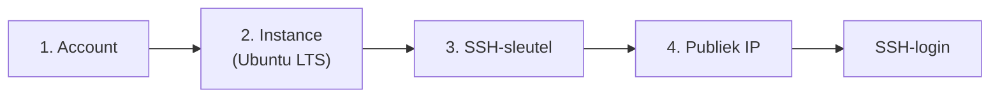

# Een cloud server (VPS) opzetten

De concrete stappen verschillen lichtjes per provider, maar het **patroon** is overal hetzelfde:

1. **Account aanmaken** bij een cloudprovider (bv. DigitalOcean, Hetzner Cloud, Azure). Voor de cursus kies je een goedkope instance (vaak een "droplet", "cloud server" of "VM" genoemd).
2. **Een instance aanmaken**:
   - **Besturingssysteem** - kies best een **Linux-instantie**, bijvoorbeeld **Ubuntu Server** (een recente LTS-versie, bv. 24.04). LTS = *Long Term Support*, dus lang ondersteund en stabiel.
   - **Grootte** - voor een statische pagina volstaat de kleinste optie (1 vCPU, 1 GB RAM).
   - **Regio** - kies een datacenter dicht bij je gebruikers (bv. Frankfurt of Amsterdam voor België).
3. **Authenticatie instellen** - voeg je **publieke SSH-sleutel** toe (zie [SSH](./ssh.md)). Dit is veiliger dan een wachtwoord.
4. **IP-adres noteren** - na het aanmaken krijgt je server een **publiek IPv4-adres** (bv. `203.0.113.10`). Via dat adres bereik je de server.

:::warning[Kosten en beveiliging]

Een VPS kost geld zolang hij bestaat - ook als je hem niet gebruikt. **Verwijder** je instance na de oefening of pauzeer hem als je provider dat toelaat. Zet bovendien meteen een **firewall** op (enkel poort 22, 80 en 443 open) en gebruik **sleutelauthenticatie** (*OLR 13*).

:::
