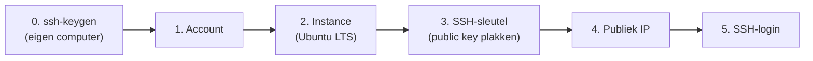

# Een cloud server (VPS) opzetten

## Wat is een VPS?

Een **VPS** (*Virtual Private Server*) is een **virtuele server** die je huurt bij een cloudprovider. Op één krachtige fysieke machine in een datacenter draaien via **virtualisatie** meerdere van zulke virtuele servers naast elkaar, elk volledig **afgeschermd** van de andere. Voor jou voelt het aan als een eigen, op zichzelf staande computer.

De naam zegt precies wat het is:

- **Virtual** — het is een virtuele machine, geen aparte fysieke kast (zie [Wat is een server?](./server.md)).
- **Private** — jouw deel is afgeschermd van de andere gebruikers op dezelfde hardware: je eigen bestanden, processen en netwerk.
- **Server** — hij staat continu aan, is via het internet bereikbaar en je beheert hem op afstand via [SSH](./ssh.md).

Je krijgt **volledige controle** met root-toegang: je kiest zelf het besturingssysteem en installeert wat je nodig hebt. Een VPS is een vorm van **IaaS** (zie [Wat is de cloud?](./cloud.md)) en is daardoor ideaal om te leren hoe deployment écht werkt - je beheert elke laag zelf, van het besturingssysteem tot de webserver.

## Een VPS aanmaken

De concrete stappen verschillen lichtjes per provider, maar het **patroon** is overal hetzelfde:

:::tip[Vooraf: maak je SSH-sleutelpaar aan]

Bij stap 3 plak je je **publieke SSH-sleutel** in. Maak die daarom **eerst** aan op je **eigen computer** (eenmalig), nog vóór je de instance aanmaakt:

```bash
ssh-keygen -t ed25519 -C "jouw.naam@school.be"
```

Dit levert een **private key** (`~/.ssh/id_ed25519`, geheim) en een **public key** (`~/.ssh/id_ed25519.pub`). Enkel de inhoud van het `.pub`-bestand kopieer je straks naar de provider. Meer uitleg: zie [SSH](./ssh.md).

:::

1. **Account aanmaken** bij een cloudprovider (bv. DigitalOcean, Hetzner Cloud, Azure). Voor de cursus kies je een goedkope instance (vaak een "droplet", "cloud server" of "VM" genoemd).
2. **Een instance aanmaken**:
   - **Besturingssysteem** - kies best een **Linux-instantie**, bijvoorbeeld **Ubuntu Server** (een recente LTS-versie, bv. 24.04). LTS = *Long Term Support*, dus lang ondersteund en stabiel.
   - **Grootte** - voor een statische pagina volstaat de kleinste optie (1 vCPU, 1 GB RAM).
   - **Regio** - kies een datacenter dicht bij je gebruikers (bv. Frankfurt of Amsterdam voor België).
3. **Authenticatie instellen** - plak de **publieke SSH-sleutel** die je hierboven aanmaakte (de inhoud van `id_ed25519.pub`). Dit is veiliger dan een wachtwoord.
4. **IP-adres noteren** - na het aanmaken krijgt je server een **publiek IPv4-adres** (bv. `203.0.113.10`). Via dat adres bereik je de server.
5. **Inloggen via SSH** - verbind met je server via het publieke IP en je private key. Zo kom je op de server terecht om hem verder te configureren:

   ```bash
   ssh gebruiker@203.0.113.10
   ```

   Meer over het inlogproces (host key, `known_hosts`): zie [SSH](./ssh.md).



:::warning[Kosten en beveiliging]

Zet meteen een **firewall** op (enkel poort 22, 80 en 443 open) en gebruik **sleutelauthenticatie** (*OLR 13*).

:::
