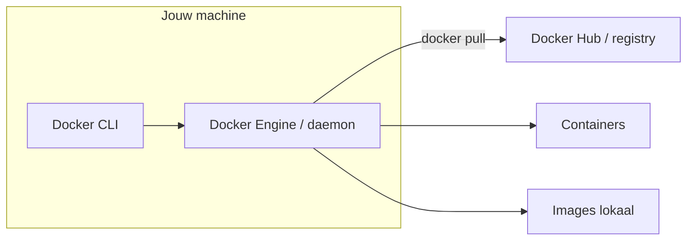
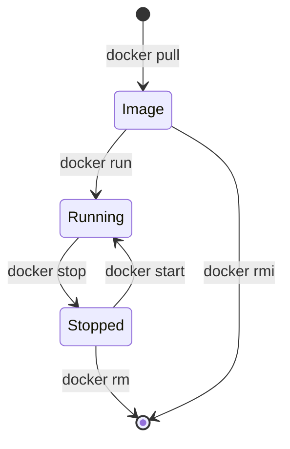

# Docker fundamentals: introductie tot containers

In dit hoofdstuk leer je wat Docker is, waarom containers in webinfrastructuur worden gebruikt, en hoe je met de basiscommando's aan de slag gaat. Je werkt met bestaande images van [Docker Hub](https://hub.docker.com/).

- Zelf images bouwen met een Dockerfile behandelen we in [hoofdstuk 6](./hoofdstuk-6-dockerfiles-images.md);
- Meerdere services samen opstarten met Compose komt in [hoofdstuk 7](./hoofdstuk-7-docker-compose-container-orchestration.md) aan bod.

## Leerdoelen

Na dit hoofdstuk kan je:

- **uitleggen** wat een container is en hoe die zich verhoudt tot een virtuele machine en tot een gewone installatie op de host (*OLR 12*);
- **motiveren** waarom teams Docker inzetten voor ontwikkeling, test en deployment (*OLR 04*, *OLR 12*);
- **de Docker-architectuur** in grote lijnen beschrijven: CLI, engine/daemon, images, containers en registry (*OLR 04*);
- **Docker installeren en controleren** lokaal op **Windows** (Docker Desktop) en op een **Linux-VPS** (Docker Engine) (*OLR 04*);
- **basisbegrippen** correct gebruiken: image, container, tag, registry, volume, poortmapping, omgevingsvariabele (*OLR 04*);
- **essentiële CLI-commando's** toepassen om images te pullen, containers te starten/stoppen, logs en poorten te bekijken, en volumes te beheren (*OLR 04*, *OLR 07*);
- **verschillende stack-onderdelen** (webserver, database, runtime) via publieke images opzetten — zonder je te beperken tot één product (*OLR 04*, *OLR 12*);
- **iteratief werken**: een containerconfiguratie aanpassen, opnieuw starten en het resultaat verifiëren (*OLR 03*, *OLR 07*).

:::info[OLR-koppeling]

Dit hoofdstuk legt de basis voor *OLR 04* (applicatie als container draaien) en *OLR 12* (containerisatie afwegen ten opzichte van traditionele deployment). Dieper werk je in hoofdstuk 6–7 verder uit hoe je eigen images bouwt en multi-container setups beheert.

:::

## Theorie

### Van applicatie op een server naar containers

Traditioneel installeer je een webapplicatie **rechtstreeks op de server**: een besturingssysteem, een runtime (Node, PHP, …), een webserver, dependencies en je code. Dat werkt, maar elke omgeving (laptop, testserver, productie) kan net iets anders zijn — andere OS-versie, andere library, andere poort. De klassieke oplossing is de **virtuele machine (VM)**: een volledige gast-OS op hypervisor-niveau, geïsoleerd maar zwaar (gigabytes disk, minuten opstarttijd).

Een **container** deelt de kernel van de host, maar draait in een **geïsoleerde omgeving** met eigen procesruimte, bestandssysteem en netwerk. Je start geen volledig tweede besturingssysteem; je start een proces (of procesgroep) met alles wat die applicatie nodig heeft, verpakt in een **image**.

| Aspect | Traditionele installatie | Virtuele machine | Container (Docker) |
|--------|--------------------------|------------------|---------------------|
| Isolatie | Beperkt (zelfde OS) | Sterk (eigen OS) | Sterk (eigen filesystem/proces) |
| Opstarttijd | N.v.t. | Minuten | Seconden |
| Grootte | Variabel | GB's | MB's tot honderden MB's |
| Reproduceerbaarheid | Vaak handmatig | Image van hele VM | Image van applicatiestack |
| Typisch gebruik | Eén app op één server | Infra-segmenten | Microservices, dev/test/prod |

### Wat is Docker?

**Docker** is een platform om containers te **bouwen**, **distribueren** en **draaien**. In de praktijk gebruik je:

- de **Docker CLI** (`docker` in de terminal) om commando's te geven;
- de **Docker Engine** (daemon) die images beheert, containers start en netwerken/volumes koppelt;
- een **registry** (meestal [Docker Hub](https://hub.docker.com/)) waar kant-en-klare images staan — webservers, databases, runtimes en meer.



**Image** — een alleen-lezen sjabloon met bestanden, dependencies en metadata (standaardcommando, poorten, …). Denk aan een “snapshot” of recept.

**Container** — een **draaiend exemplaar** van een image. Je kunt van dezelfde image meerdere containers starten (bijv. twee webserver-containers op verschillende hostpoorten).

**Tag** — een versie-label bij een image, bijvoorbeeld `httpd:2.4` of `postgres:16`. `latest` is geen garantie voor “nieuwste stabiel”; in productie kies je liever een **vaste tag**.

**Volume** — opslag **buiten** de levensduur van één container. Zonder volume gaan wijzigingen in de container-filesystem verloren bij `docker rm`.

**Registry** — opslagplaats voor images. Publiek via Docker Hub; teams gebruiken ook private registries (GitHub Container Registry, Azure, …). Images taggen en publiceren behandelen we in hoofdstuk 6.

### Waarom gebruiken teams Docker?

1. **“Works on my machine” verminderen** — dezelfde image draait lokaal, op de CI-runner en op de VPS.
2. **Snel opstarten en afbreken** — handig voor testen en schalen.
3. **Isolatie** — meerdere apps op één server zonder elkaars dependencies te breken.
4. **Documentatie als code** — wat in de image zit, is expliciet (in hoofdstuk 6 via een Dockerfile).
5. **Aansluiting op moderne infra** — Compose, orchestrators (Kubernetes, Swarm), CI/CD-pipelines.

Docker is geen vervanging voor goede **beveiliging**, **monitoring** of **back-ups**. Het maakt deployment **reproduceerbaarder**; je blijft poorten, secrets, HTTPS en updates bewust configureren (*OLR 13*).

### Wat heb je nodig om Docker te runnen?

In deze cursus werk je op **twee typische omgevingen**:

| Omgeving | Besturingssysteem | Installatie |
|----------|------------------|-------------|
| **Lokaal** (laptop, oefeningen) | **Windows** | [Docker Desktop](https://www.docker.com/products/docker-desktop/) — engine, CLI en beheer via WSL 2 |
| **VPS** (deployment, server) | **Linux** | **Docker Engine** (geen Desktop) via pakketbeheer of officiële Docker-repo |

De **CLI-commando's** (`docker run`, `docker ps`, …) zijn grotendeels hetzelfde; verschillen zitten vooral in installatie, paden en rechten.

#### Lokaal: Windows met Docker Desktop

- Zorg dat **virtualisatie** in het BIOS/UEFI aan staat en dat **WSL 2** geïnstalleerd is (vereiste voor recente Docker Desktop-versies).
- Start Docker Desktop en wacht tot de engine “running” is.
- Gebruik **PowerShell**, **cmd** of een WSL-terminal — overal waar `docker` beschikbaar is.

Controle na installatie:

```bash
docker --version
docker compose version
docker run hello-world
```

`hello-world` downloadt een kleine test-image en bevestigt dat de engine bereikbaar is.

#### Op de VPS: Linux met Docker Engine

Op de server installeer je typisch alleen de **engine** (geen grafische Desktop). Na installatie:

```bash
sudo systemctl enable docker
sudo systemctl start docker
docker run hello-world
```

Je gebruiker toevoegen aan de groep `docker` (optioneel, om `sudo` te vermijden):

```bash
sudo usermod -aG docker $USER
# daarna opnieuw inloggen
```

:::warning[Rechten op Linux]

Wie Docker mag gebruiken, heeft in de praktijk **root-niveau** op de host. Beperk SSH-toegang en groepslidmaatschap bewust (*OLR 13*).

:::

#### Systeemvereisten (richtlijn)

- **64-bit** CPU met virtualisatie (lokaal op Windows via Hyper-V/WSL 2).
- Voldoende **schijfruimte** voor images (meerdere GB is normaal).
- Op de VPS: voldoende RAM en disk voor alle containers die je tegelijk draait.

#### Wat je in dit hoofdstuk nog níet nodig hebt

- Een eigen **Dockerfile** ([hoofdstuk 6](./hoofdstuk-6-dockerfiles-images.md)).
- Een **docker-compose.yml** ([hoofdstuk 7](./hoofdstuk-7-docker-compose-container-orchestration.md)).
- Een account op Docker Hub — alleen nodig als je zelf images publiceert (hoofdstuk 6).

### Kant-en-klare images: geen vaste stack

Docker is **niet gebonden aan één webserver of één database**. Je kiest per project een image die past bij je stack. De workflow (`pull` → `run` → volumes/poorten) blijft dezelfde; enkel image-naam, poorten en omgevingsvariabelen verschillen.

| Rol | Voorbeelden op Docker Hub | Typische containerpoort |
|-----|---------------------------|-------------------------|
| **Webserver** | `nginx`, `httpd` (Apache), `caddy` | 80, 443 |
| **Database (relationeel)** | `mysql`, `mariadb`, `postgres` | 3306, 5432 |
| **Database (NoSQL)** | `mongo` | 27017 |
| **Runtime / app** | `node`, `python`, `php` | projectafhankelijk |

:::tip[Zelfde concept, andere image]

`docker run -d -p 8080:80 …` werkt voor **nginx**, **httpd** of **caddy** — je past enkel de image-naam en eventueel de containernaam aan. Voor databases lees je de documentatie van de image (verplichte `-e`-variabelen, data-pad voor volumes).

:::

Volledige commando's en flags staan in de [Docker-commandoreferentie](#docker-commandoreferentie) onderaan dit hoofdstuk.

### De levenscyclus: van image naar draaiende container

Typische workflow voor beginners:

1. **Image ophalen** — `docker pull IMAGE:tag` (of impliciet bij de eerste `docker run`).
2. **Container starten** — `docker run` maakt een nieuwe container en start het proces.
3. **Gebruiken** — browser, `curl`, logs bekijken, eventueel `docker exec` voor een shell.
4. **Stoppen** — `docker stop`; later `docker start` om dezelfde container weer te gebruiken.
5. **Opruimen** — `docker rm` (container), `docker rmi` (image), `docker volume rm` (volume).



### Poorten, omgevingsvariabelen en volumes

#### Poortmapping (`-p`)

Containers hebben een **eigen netwerk**. Om een webservice op je laptop te bereiken, map je een **hostpoort** naar een **containerpoort**:

```bash
# Voorbeeld met nginx — even goed met httpd of caddy
docker run -d -p 8080:80 --name mijn-web nginx:latest

# Zelfde patroon, andere webserver
docker run -d -p 8081:80 --name mijn-apache httpd:2.4
```

- `-d` — detached (op de achtergrond).
- `-p HOST:CONTAINER` — hostpoort → containerpoort (vaak `80` voor HTTP).
- `--name` — leesbare naam i.p.v. een random ID.

Open lokaal `http://localhost:8080` (of de gekozen hostpoort). Zonder `-p` is de service enkel **binnen** het Docker-netwerk bereikbaar.

#### Omgevingsvariabelen (`-e`)

Veel images verwachten configuratie via **environment variables**:

```bash
# MySQL / MariaDB
docker run -d --name mijn-mysql \
  -e MYSQL_ROOT_PASSWORD=geheim \
  -e MYSQL_DATABASE=voorbeeld \
  mysql:8.0

# PostgreSQL
docker run -d --name mijn-postgres \
  -e POSTGRES_PASSWORD=geheim \
  -e POSTGRES_DB=voorbeeld \
  postgres:16

# MongoDB
docker run -d --name mijn-mongo \
  -e MONGO_INITDB_ROOT_USERNAME=admin \
  -e MONGO_INITDB_ROOT_PASSWORD=geheim \
  mongo:7
```

Elke image documenteert zijn **eigen** omgevingsvariabelen op Docker Hub. Gebruik in oefeningen **sterke wachtwoorden**; commit geen echte secrets naar Git (*OLR 13*).

#### Volumes (`-v` / `docker volume`)

Container-filesystem is **ephemeral**: na verwijderen is data weg. Voor databases of uploads gebruik je een **volume**:

```bash
docker volume create db_data
docker run -d --name mijn-mysql \
  -e MYSQL_ROOT_PASSWORD=geheim \
  -v db_data:/var/lib/mysql \
  mysql:8.0
```

Het **pad in de container** (`/var/lib/mysql`, `/var/lib/postgresql/data`, …) staat in de image-documentatie. Volume-commando's (`create`, `ls`, `inspect`, `rm`) staan in de [commandoreferentie](#docker-commandoreferentie).

**Bind mount** (`-v /host/pad:/container/pad`) koppelt een map op je computer (Windows/WSL) of VPS aan de container — handig in ontwikkeling; op servers gebruik je vaker **named volumes**.

### Basiscommando's in de praktijk

Je dagelijkse gereedschap in dit hoofdstuk:

| Stap | Commando's |
|------|------------|
| Status | `docker ps`, `docker ps -a`, `docker images`, `docker logs` |
| Starten | `docker pull`, `docker run` (met `-d`, `-p`, `-e`, `-v`, `--name`) |
| Beheren | `docker stop`, `docker start`, `docker restart`, `docker exec -it` |
| Opruimen | `docker rm`, `docker rmi`, `docker volume rm` |

Korte voorbeelden (willekeurige image):

```bash
docker run -it ubuntu:22.04 bash
docker run -d -p 8080:80 --name demo-web nginx:latest
docker logs -f demo-web
docker exec -it demo-web sh
```

:::info[Commandoreferentie]

Alle CLI-commando's met parameters en voorbeelden staan in [Docker-commandoreferentie](#docker-commandoreferentie). Gebruik die sectie tijdens oefeningen als naslagwerk.

:::

:::warning[Data en volumes]

`docker rm` verwijdert de container, **niet** automatisch het volume. Gebruik `docker volume ls` en `docker volume rm` bewust — anders blijft schijfgebruik groeien.

:::

### Images gebruiken zonder ze zelf te bouwen

In dit hoofdstuk **pull** je kant-en-klare images. Zo kan je elke gangbare component van een webstack proberen — **zonder** die software op Windows of de VPS te installeren:

- **Webservers** — nginx, Apache (`httpd`), Caddy, …
- **Databases** — MySQL/MariaDB, PostgreSQL, MongoDB, …
- **Runtimes** — Node, Python, PHP, …

Het doel is dat je **niet vastzit aan één product**, maar de **Docker-workflow** beheerst: image kiezen, container configureren, data persistent maken, bereikbaarheid testen.

In [hoofdstuk 6](./hoofdstuk-6-dockerfiles-images.md) leer je met `docker build` en een **Dockerfile** eigen images maken, lagen en caching te begrijpen, en images te taggen en te publiceren (`docker tag`, `docker push`). De [commandoreferentie](#dockerfile-syntax-vooruitblik-hoofdstuk-6) bevat al de Dockerfile-instructies als naslag.

### Veelgemaakte fouten (troubleshooting)

| Symptoom | Mogelijke oorzaak | Wat te doen |
|--------|-------------------|-------------|
| `Cannot connect to the Docker daemon` | Engine draait niet | Windows: Docker Desktop starten — VPS: `sudo systemctl start docker` |
| `port is already allocated` | Hostpoort in gebruik | Kies andere `-p` (bv. `8081:80`) of stop de andere service |
| Lege pagina op `localhost` | Verkeerde poort of container gestopt | `docker ps`, `docker logs` |
| `Conflict. The container name ... is already in use` | Naam bestaat al | Andere `--name` of `docker rm` oude container |
| Geen data na herstart | Geen volume gebruikt | `-v` of named volume toevoegen |
| Image kan niet verwijderd worden | Nog containers gebruiken image | Eerst containers `docker rm` |

Dit sluit aan bij *OLR 07*: na deployment (of lokaal runnen) **verifieer** je bereikbaarheid en gebruik **logs** om problemen te lokaliseren.

### Samenvatting

- Een **container** is een lichtgewicht, geïsoleerd proces op basis van een **image**.
- **Docker** bestaat uit CLI + engine + (meestal) een registry.
- Lokaal: **Docker Desktop op Windows**; op de VPS: **Docker Engine op Linux**.
- Met **`docker pull` / `docker run` / `docker ps` / `docker logs` / volumes en `-p`** deploy je willekeurige stack-componenten uit Docker Hub.
- Zie de [commandoreferentie](#docker-commandoreferentie) als naslag; Dockerfile en Compose volgen in hoofdstuk 6–7.

## Oefeningen

*(Wordt nog uitgewerkt. Gebruik bij het oefenen de [Docker-commandoreferentie](#docker-commandoreferentie) als naslag — kies zelf welke image je inzet, bv. een andere webserver of database dan in de theorie-voorbeelden.)*

---

## Docker-commandoreferentie

Naslagwerk bij dit hoofdstuk (gebaseerd op de cursus-cheatsheet). Secties over **Dockerfile** en **Compose** zijn bedoeld als vooruitblik op hoofdstuk 6 en 7; in de oefeningen van hoofdstuk 5 heb je ze nog niet nodig.

### Docker CLI

#### `docker pull`

- **Beschrijving:** Haalt een image op uit een registry (zoals Docker Hub).
- **Voorbeeld:**

```bash
docker pull ubuntu:latest
docker pull postgres:16
```

#### `docker build`

- **Beschrijving:** Bouwt een image op basis van een Dockerfile (*hoofdstuk 6*).
- **Parameter:** `-t` — naam en optionele tag (`name:tag`)
- **Voorbeeld:**

```bash
docker build -t mijn_image:1.0 .
```

#### `docker run`

- **Beschrijving:** Start een nieuwe container op basis van een image.
- **Parameters:**
  - `-d` — op de achtergrond (detached)
  - `-p` — poortmapping `HOST:CONTAINER`
  - `-i` — stdin openhouden
  - `-t` — pseudo-terminal (samen met `-i` → `-it`)
  - `--name` — vaste containernaam
  - `-v` — volume `BRON:PAD_IN_CONTAINER`
  - `-e` — omgevingsvariabele
- **Voorbeelden:**

```bash
docker run ubuntu:latest
docker run -d -p 80:80 httpd:2.4
docker run -d --name mijn_app -e APP_ENV=production -v app_data:/app/data mijn_image
```

#### `docker start` / `docker stop` / `docker restart`

- **Beschrijving:** Herstart, stopt of herstart een bestaande container.
- **Voorbeelden:**

```bash
docker start mijn_container
docker stop mijn_container
docker restart mijn_container
```

#### `docker ps`

- **Beschrijving:** Toont draaiende containers.
- **Parameter:** `-a` — inclusief gestopte containers
- **Voorbeeld:**

```bash
docker ps
docker ps -a
```

#### `docker images`

- **Beschrijving:** Toont lokale images.
- **Parameters:** `-a` (alle lagen), `-f` (filter), `--no-trunc`
- **Voorbeeld:**

```bash
docker images
docker images -a
```

#### `docker rm` / `docker rmi`

- **Beschrijving:** Verwijdert een container (`rm`) of image (`rmi`).
- **Voorbeelden:**

```bash
docker rm mijn_container
docker rmi mijn_image:tag
```

#### `docker exec`

- **Beschrijving:** Voert een commando uit in een **draaiende** container.
- **Parameter:** `-it` — interactieve shell
- **Voorbeeld:**

```bash
docker exec -it mijn_container sh
```

#### `docker commit`

- **Beschrijving:** Maakt een nieuw image van een container (*niet de aanbevolen workflow* — prefer Dockerfile in hst 6).
- **Parameters:** `-a` (auteur), `-m` (bericht)
- **Voorbeeld:**

```bash
docker commit mijn_container mijn_image
docker commit -a "Jane Doe" -m "Tussentijdse staat" mijn_container nieuweimage:v1
```

#### `docker tag` / `docker push`

- **Beschrijving:** Tag toekennen en image naar een registry pushen (*hoofdstuk 6*).
- **Voorbeelden:**

```bash
docker tag mijn_image mijn_repo/mijn_image:latest
docker push mijn_repo/mijn_image:latest
```

#### Volumes

| Commando | Beschrijving |
|----------|--------------|
| `docker volume create naam` | Nieuw volume |
| `docker volume ls` | Alle volumes |
| `docker volume inspect naam` | Details |
| `docker volume rm naam` | Volume verwijderen |

```bash
docker volume create mijn_volume
docker volume ls
docker volume inspect mijn_volume
docker volume rm mijn_volume
```

---

### Dockerfile-syntax (vooruitblik hoofdstuk 6)

| Instructie | Beschrijving | Voorbeeld |
|------------|--------------|-----------|
| `FROM` | Basisimage | `FROM ubuntu:22.04` |
| `WORKDIR` | Werkmap in container | `WORKDIR /app` |
| `COPY` | Bestanden van host naar image | `COPY . /app` |
| `RUN` | Commando tijdens build | `RUN apt-get update && apt-get install -y nginx` |
| `ENV` | Omgevingsvariabele | `ENV PORT=8080` |
| `EXPOSE` | Documentatie van poort | `EXPOSE 8080` |
| `VOLUME` | Mountpoint voor persistente data | `VOLUME /var/lib/mysql` |
| `CMD` | Standaardcommando bij start | `CMD ["nginx", "-g", "daemon off;"]` |

---

### Docker Compose (vooruitblik hoofdstuk 7)

#### `docker compose up`

- **Beschrijving:** Start alle services uit `docker-compose.yml`.
- **Parameters:** `-d` (achtergrond), `--build` (images herbouwen)
- **Voorbeelden:**

```bash
docker compose up
docker compose up -d
docker compose up --build
```

#### `docker compose down`

- **Beschrijving:** Stopt en verwijdert containers en netwerken van het project.
- **Parameter:** `-v` — verwijdert ook volumes
- **Voorbeelden:**

```bash
docker compose down
docker compose down -v
```

#### `docker compose start` / `stop` / `restart`

- **Beschrijving:** Beheert bestaande containers zonder nieuwe aan te maken.
- **Voorbeeld:**

```bash
docker compose start
docker compose stop webserver
docker compose restart
```

#### `docker compose ps` / `logs` / `exec` / `build` / `pull`

```bash
docker compose ps
docker compose logs -f
docker compose logs --tail 50 db
docker compose exec webserver sh
docker compose build --no-cache
docker compose pull
```

---

### `docker-compose.yml` (vooruitblik hoofdstuk 7)

| Sleutel | Beschrijving |
|---------|--------------|
| `services` | Containers van de applicatie |
| `image` | Kant-en-klare image per service |
| `build` | Image bouwen uit lokale Dockerfile |
| `ports` | `HOST:CONTAINER` poortmapping |
| `environment` | Omgevingsvariabelen |
| `volumes` | Persistente opslag (declaratie onderaan) |
| `depends_on` | Opstartvolgorde |
| `networks` | Eigen Docker-netwerken |
| `restart` | `no`, `always`, `on-failure`, `unless-stopped` |
| `healthcheck` | Periodieke gezondheidstest |

**Voorbeeld — meerdere services:**

```yaml
services:
  webserver:
    image: nginx:latest
    ports:
      - "8080:80"
    restart: unless-stopped
  db:
    image: postgres:16
    environment:
      POSTGRES_PASSWORD: geheim
      POSTGRES_DB: mijndb
    volumes:
      - db_data:/var/lib/postgresql/data

volumes:
  db_data:
```

**`depends_on` met healthcheck:**

```yaml
services:
  app:
    build: .
    depends_on:
      db:
        condition: service_healthy
  db:
    image: postgres:16
    healthcheck:
      test: ["CMD-SHELL", "pg_isready -U postgres"]
      interval: 10s
      timeout: 5s
      retries: 5
      start_period: 30s
```
